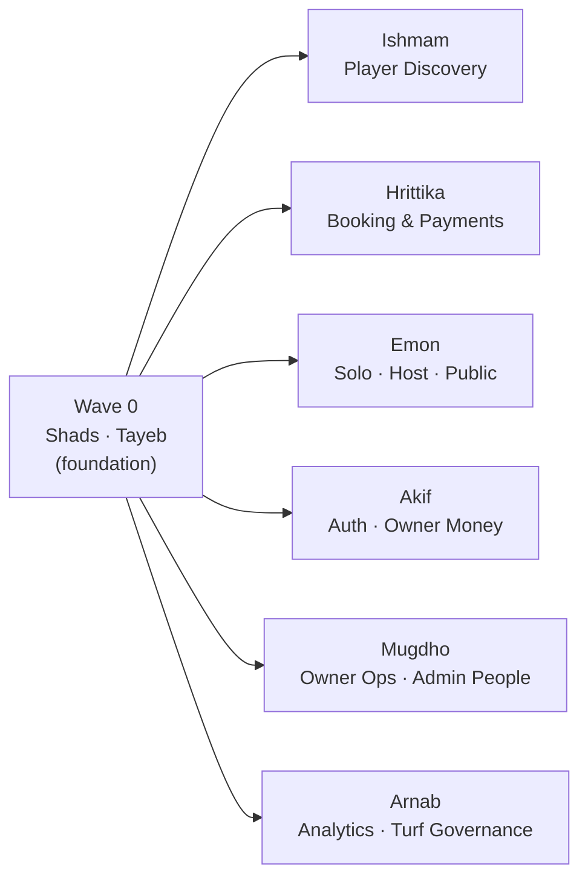

# TurfChai — Contribution Plan

**Project:** TurfChai React Frontend
**Stack:** React 19 · React Router 7 · Vite 7 · JavaScript · Context API · Global CSS
**Team size:** 8
**Scope:** 168 source files under `src/` (~19,185 LOC) + 6 root configuration files

> This document assigns **ownership only**. No files are moved, renamed, or restructured.
> Every existing file has exactly **one primary owner**. Shared files are listed in §Shared Files
> and require discussion before modification.

---

## Table of Contents

1. [Ownership Principles](#1-ownership-principles)
2. [Member Assignments](#2-member-assignments)
3. [Folder Ownership Table](#3-folder-ownership-table)
4. [Shared Files](#4-shared-files)
5. [Parallel Development Order](#5-parallel-development-order)
6. [Merge Order](#6-merge-order)
7. [Branch Names](#7-branch-names)
8. [Commit Guidelines](#8-commit-guidelines)
9. [Pull Request Plan](#9-pull-request-plan)
10. [Conflict Prevention](#10-conflict-prevention)
11. [Workload Summary](#11-workload-summary)

---

## 1. Ownership Principles

| Principle | Rule |
|---|---|
| **Single primary owner** | Every file has one owner. Others may read/import freely, but must not edit without a review request. |
| **Vertical slices** | Ownership follows product domains (Player, Owner, Admin, Solo, Host) so members rarely touch the same file. |
| **Foundation owners** | Two members own the cross-cutting foundation (design system, app shell). Their LOC count is lower but their file count and blast radius are the highest — workload is weighted by complexity, not lines. |
| **Import ≠ own** | Importing `<Button>` does not grant the right to edit `Button.jsx`. Raise an issue with the owner instead. |
| **Shared files** | Config + entry + routing files are change-controlled. See §4. |

---

## 2. Member Assignments

### 2.1 Shads — Design System & Shared UI Kit

**Domain:** Visual language, tokens, theming, and the presentational component library consumed by all other members.

| Category | Items |
|---|---|
| **Assigned folders** | `src/styles/`, `src/components/ui/`, `src/components/buttons/`, `src/components/layout/` |
| **Styling files** | `tokens.css`, `base.css`, `layout.css`, `navigation.css`, `buttons.css`, `forms.css`, `badges.css`, `cards.css`, `booking.css`, `data-display.css`, `overlays.css`, `modules.css`, `responsive.css`, `landing.css`, `viewas.css`, `theme-accents.css`, `liquid-glass.css`, `console.css`, `index.css` ⚠️, `app.css` ⚠️ |
| **Components owned** | `ui/Alert`, `ui/Avatar`, `ui/Badge`, `ui/Chip`, `ui/EmptyState`, `ui/LockTimer`, `ui/Panel`, `ui/Photo`, `ui/Progress`, `ui/Skeleton`, `ui/Stars`, `ui/Tags`, `ui/Timeline`, `buttons/Button`, `buttons/IconButton`, `buttons/BackButton`, `buttons/ThemeToggle`, `layout/Primitives`, `layout/Section`, `layout/SiteFooter`, `layout/StickyBar`, `cards/Card` |
| **Pages** | — (none, by design) |
| **Hooks / Contexts / Utils / Data** | — |
| **Assets** | Inline SVG icon set styling, favicon data-URI in `index.html` (shared) |
| **Responsibilities** | Guard the 18-file cascade order in `styles/index.css`; keep light/dark parity for every token; approve any new global class; review all PRs that add inline `style={{}}` and push them into CSS where reusable; maintain accessibility helpers (`.sr-only`, `.skip-link`, focus rings). |
| **Workload** | **11%** — 42 files, ~1,834 LOC |
| **Commits (est.)** | 14–18 |
| **PR sequence** | `PR-1` tokens + base + theming → `PR-2` buttons/forms/badges CSS → `PR-3` `components/ui` kit → `PR-4` `components/layout` primitives + footer → `PR-5` responsive + liquid-glass polish |

---

### 2.2 Tayeb — Architecture, Routing, State & Layouts

**Domain:** Application shell, navigation chrome, global state, hooks, and the data layer.

| Category | Items |
|---|---|
| **Assigned folders** | `src/routes/`, `src/context/`, `src/hooks/`, `src/utils/`, `src/constants/`, `src/layouts/`, `src/data/`, `src/components/navigation/`, `src/components/common/`, `src/components/modals/` |
| **Assigned files** | `src/main.jsx` ⚠️, `src/App.jsx` ⚠️, `src/routes/AppRoutes.jsx` ⚠️, `src/routes/paths.js` ⚠️ |
| **Components owned** | `navigation/Topbar`, `navigation/BottomNav`, `navigation/Sidebar`, `navigation/Tabs`, `navigation/Stepper`, `navigation/Breadcrumbs`, `navigation/ViewAsMenu`, `common/Brand`, `common/Icon`, `common/LiquidOrbs`, `common/PageTitle`, `common/RouteFallback`, `common/ScrollToTop`, `common/ErrorBoundary`, `modals/Overlay` |
| **Pages** | — (owns the 6 layouts that wrap every page) |
| **Hooks owned** | `useTheme`, `useToast`, `useSidebar`, `useDisclosure`, `useClickOutside`, `useEscapeKey`, `useMediaQuery`, `useCountdown`, `useFilterChips`, `useQueryParam`, `useLockBodyScroll`, `useBodyClass` |
| **Contexts owned** | `ThemeContext`, `ToastContext`, `SidebarContext` |
| **Utilities owned** | `utils/cn.js`, `utils/format.js`, `constants/app.js`, `constants/navigation.js` |
| **Data owned** | `data/users.js`, `data/notifications.js`, `data/venues.js`, `data/games.js`, `data/tournaments.js`, `data/bookings.js`, `data/admin.js`, `data/owner.js` |
| **Responsibilities** | Own the route registry — **no member hardcodes a URL string**, they request a `paths.*` entry; keep every route lazy-loaded; maintain layout contracts (layouts own `<main>`, pages emit inner content only); serve mock data on request from domain owners; enforce the `react-hooks` v7 rules; act as integration reviewer on every PR. |
| **Workload** | **13%** — 52 files, ~2,294 LOC |
| **Commits (est.)** | 16–20 |
| **PR sequence** | `PR-1` paths + constants + utils → `PR-2` contexts + hooks → `PR-3` `components/common` + `Overlay` → `PR-4` `components/navigation` → `PR-5` 6 layouts → `PR-6` `AppRoutes` lazy wiring → `PR-7` `data/` modules |

---

### 2.3 Ishmam — Player Discovery, Venue & Admin Turf Detail

**Domain:** How a player finds a turf, and the admin mirror of a turf profile.

| Category | Items |
|---|---|
| **Assigned files** | `pages/player/HomePage.jsx`, `pages/player/HomePage.css`, `pages/player/ExplorePage.jsx`, `pages/player/ExplorePage.css`, `pages/player/VenuePage.jsx`, `pages/player/VenuePage.css`, `pages/player/OnboardingPage.jsx`, `pages/admin/TurfDetailsPage.jsx`, `pages/admin/TurfDetailsPage.css`, `components/cards/VenueCard.jsx` |
| **Components owned** | `cards/VenueCard` |
| **Pages owned** | Player Home (unified dashboard w/ mode switcher), Explore (search + filter drawer + tournament chips), Venue Detail (gallery, slot grid, reviews), Player Onboarding, Admin Turf Details |
| **Hooks / Contexts / Utils** | — (consumer of `useFilterChips`, `useQueryParam`) |
| **Styling files** | Page-scoped: `HomePage.css`, `ExplorePage.css`, `VenuePage.css`, `TurfDetailsPage.css` |
| **Responsibilities** | Own the discovery funnel and filter/search UX; keep the player venue view and admin turf view visually consistent; ensure `?mode=player|solo|host` deep links behave; coordinate slot-grid props with Hrittika. |
| **Workload** | **13%** — 10 files, ~2,652 LOC |
| **Commits (est.)** | 16–20 |
| **PR sequence** | `PR-1` VenueCard + Explore → `PR-2` Venue Detail → `PR-3` Player Home dashboard → `PR-4` Player Onboarding → `PR-5` Admin Turf Details |

---

### 2.4 Hrittika — Player Booking, Checkout, Payments & Rewards

**Domain:** Everything from "select a slot" to "money moved" plus post-match loops.

| Category | Items |
|---|---|
| **Assigned folders** | `src/components/booking/` |
| **Assigned files** | `pages/player/CheckoutPage.jsx`, `pages/player/CheckoutPage.css`, `pages/player/BookingsPage.jsx`, `pages/player/BookingDetailPage.jsx`, `pages/player/BookingDetailPage.css`, `pages/player/BookingSuccessPage.jsx`, `pages/player/CancelPage.jsx`, `pages/player/PaymentRetryPage.jsx`, `pages/player/SplitPaymentPage.jsx`, `pages/player/SplitPaymentPage.css`, `pages/player/ReviewPage.jsx`, `pages/player/ReviewPage.css`, `pages/player/RewardsPage.jsx`, `pages/player/RewardsPage.css`, `pages/player/MatchdayPage.jsx` |
| **Components owned** | `booking/SlotGrid` (incl. `DateStrip`), `booking/PriceBreakdown` (incl. `PriceRow`) |
| **Pages owned** | Checkout, My Bookings, Booking Detail, Booking Success, Cancel & Refund, Payment Retry, Split Payment, Review, Rewards, Matchday |
| **Styling files** | `CheckoutPage.css`, `BookingDetailPage.css`, `SplitPaymentPage.css`, `ReviewPage.css`, `RewardsPage.css` |
| **Responsibilities** | Own the money path — bKash/Nagad method selection, `৳` formatting via `formatBdt`, slot-lock countdown, refund policy copy, split-payment roster state, loyalty tiers; the most error-prone flow, so every page needs an empty, loading, and failure state. |
| **Workload** | **12%** — 17 files, ~2,277 LOC |
| **Commits (est.)** | 18–22 |
| **PR sequence** | `PR-1` `components/booking` primitives → `PR-2` Checkout + Success → `PR-3` Bookings list + Detail → `PR-4` Cancel + Payment Retry + Split Payment → `PR-5` Review + Matchday → `PR-6` Rewards |

---

### 2.5 Emon — Solo Games, Host Tournaments & Public Site

**Domain:** Player-vs-stranger matchmaking, tournament hosting tools, and the public marketing surface.

| Category | Items |
|---|---|
| **Assigned folders** | `src/pages/solo/`, `src/pages/host/`, `src/pages/public/` |
| **Assigned files** | `solo/OpenGamesPage.jsx`, `solo/OpenGamesPage.css`, `solo/GameDetailPage.jsx`, `solo/GameDetailPage.css`, `solo/LfgAlertPage.jsx`, `solo/TicketPage.jsx`, `host/TournamentPage.jsx`, `host/MultiPitchPage.jsx`, `host/MultiPitchPage.css`, `host/ReservePage.jsx`, `public/LandingPage.jsx`, `public/NotFoundPage.jsx`, `components/cards/GameCard.jsx` |
| **Components owned** | `cards/GameCard` |
| **Pages owned** | Open Games, Game Detail, LFG Alert, Ticket, Tournament Hub, Multi-Pitch Timeline, Reserve Pitches, Landing, 404 |
| **Styling files** | `OpenGamesPage.css`, `GameDetailPage.css`, `MultiPitchPage.css` |
| **Responsibilities** | Own the LFG/roster/skill-tier model, tournament privacy + invite-link flow, multi-pitch scheduling grid, and the marketing landing page (hero, stat row, CTA band) — the first screen every new visitor sees. |
| **Workload** | **12%** — 13 files, ~2,315 LOC |
| **Commits (est.)** | 15–19 |
| **PR sequence** | `PR-1` GameCard + Open Games → `PR-2` Game Detail + Ticket + LFG Alert → `PR-3` Tournament Hub → `PR-4` Multi-Pitch + Reserve → `PR-5` Landing + 404 |

---

### 2.6 Akif — Authentication, Onboarding & Owner Monetization

**Domain:** Every identity entry point plus the turf owner's revenue tooling.

| Category | Items |
|---|---|
| **Assigned folders** | `src/components/forms/`, `src/pages/auth/` |
| **Assigned files** | `pages/auth/AuthPage.jsx`, `pages/admin/AdminLoginPage.jsx`, `pages/owner/OwnerOnboardingPage.jsx`, `pages/owner/VenueSetupPage.jsx`, `pages/owner/PromotionsPage.jsx`, `pages/owner/PaymentsPage.jsx` |
| **Components owned** | `forms/Field` (incl. `Input`), `forms/OtpInput`, `forms/SearchBar`, `forms/Toggles` |
| **Pages owned** | Player/Owner Auth (role segment + OTP), Admin Login, Owner Onboarding, Venue Setup, Promotions, Payments & Payouts |
| **Hooks / Contexts / Utils** | — (consumer of `useBodyClass`, `useToast`) |
| **Responsibilities** | Own all form primitives and their validation/focus-ring behaviour; role-aware auth redirects (owner sign-up → onboarding, owner sign-in → owner dashboard); pricing rules, promo codes, payout schedules and settlement tables. Highest security surface — never log or persist credentials; treat all mock tokens as placeholders. |
| **Workload** | **12%** — 10 files, ~2,242 LOC |
| **Commits (est.)** | 15–19 |
| **PR sequence** | `PR-1` `components/forms` primitives → `PR-2` AuthPage + AdminLogin → `PR-3` Owner Onboarding → `PR-4` Venue Setup → `PR-5` Promotions → `PR-6` Payments & Payouts |

---

### 2.7 Mugdho — Owner Operations Console & Admin People Management

**Domain:** The day-to-day turf owner console and admin-side account management.

| Category | Items |
|---|---|
| **Assigned folders** | `src/components/tables/` |
| **Assigned files** | `pages/owner/DashboardPage.jsx`, `pages/owner/DashboardPage.css`, `pages/owner/CalendarPage.jsx`, `pages/owner/BookingsPage.jsx`, `pages/owner/CustomersPage.jsx`, `pages/owner/ReviewsPage.jsx`, `pages/owner/StaffPage.jsx`, `pages/admin/UsersPage.jsx`, `pages/admin/AdminsPage.jsx`, `pages/admin/ActivityPage.jsx`, `pages/admin/ProfilePage.jsx`, `pages/admin/ProfilePage.css`, `components/cards/KpiCard.jsx` |
| **Components owned** | `tables/DataTable`, `cards/KpiCard` (incl. `SparkBar`) |
| **Pages owned** | Owner Dashboard, Calendar, Owner Bookings, Customers, Reviews, Staff, Admin Users, Admin Admins, Activity Log, Admin Profile |
| **Styling files** | `owner/DashboardPage.css`, `admin/ProfilePage.css` |
| **Responsibilities** | Own the tabular/console UX — `DataTable` column contracts, sticky headers, mobile overflow, row-state colours; QR check-in gate on the owner dashboard; RBAC display for admins/staff; audit-log filtering. Owner console shares `.shell` layout with Akif's pages — coordinate sidebar nav changes with Tayeb. |
| **Workload** | **14%** — 14 files, ~2,797 LOC |
| **Commits (est.)** | 18–22 |
| **PR sequence** | `PR-1` `DataTable` + `KpiCard` → `PR-2` Owner Dashboard + QR gate → `PR-3` Calendar + Owner Bookings → `PR-4` Customers + Reviews + Staff → `PR-5` Admin Users + Admins → `PR-6` Activity Log + Admin Profile |

---

### 2.8 Arnab — Admin Platform Analytics & Turf Governance

**Domain:** Super-admin oversight — platform metrics, growth analytics, and the turf approval pipeline.

| Category | Items |
|---|---|
| **Assigned folders** | `src/components/charts/` |
| **Assigned files** | `pages/admin/DashboardPage.jsx`, `pages/admin/DashboardPage.css`, `pages/admin/UserGrowthPage.jsx`, `pages/admin/UserGrowthPage.css`, `pages/admin/UserSegmentsPage.jsx`, `pages/admin/TurfsPage.jsx`, `pages/admin/TurfRequestsPage.jsx`, `pages/admin/RequestReviewPage.jsx`, `pages/admin/RequestReviewPage.css`, `components/charts/ChartCanvas.jsx` |
| **Components owned** | `charts/ChartCanvas` |
| **Pages owned** | Admin Dashboard, User Growth, User Segments, Turf Directory, Turf Requests, Request Review |
| **Styling files** | `admin/DashboardPage.css`, `admin/UserGrowthPage.css` |
| **Responsibilities** | Sole owner of the Chart.js integration — instance lifecycle (create/destroy), theme-aware axis + grid colours, and the lazy chunk boundary that keeps `chart.js` out of the main bundle; own the turf verification workflow (submit → review → approve/reject) and platform earnings/volume reporting. **Chart bundle budget: `ChartCanvas` chunk must stay under 250 kB raw.** |
| **Workload** | **13%** — 10 files, ~2,774 LOC |
| **Commits (est.)** | 16–20 |
| **PR sequence** | `PR-1` `ChartCanvas` wrapper → `PR-2` Admin Dashboard + KPI/chart grid → `PR-3` User Growth → `PR-4` User Segments → `PR-5` Turf Directory + Turf Requests → `PR-6` Request Review |

---

## 3. Folder Ownership Table

| Member | Folder(s) | Files | Ownership |
|---|---|---:|---|
| **Shads** | `src/styles/`, `src/components/ui/`, `src/components/buttons/`, `src/components/layout/`, `components/cards/Card.jsx` | 42 | Full — design tokens, theming, presentational kit |
| **Tayeb** | `src/routes/`, `src/context/`, `src/hooks/`, `src/utils/`, `src/constants/`, `src/layouts/`, `src/data/`, `src/components/navigation/`, `src/components/common/`, `src/components/modals/`, `src/main.jsx`, `src/App.jsx` | 52 | Full — app shell, routing, state, data layer |
| **Ishmam** | `pages/player/{Home,Explore,Venue,Onboarding}*`, `pages/admin/TurfDetailsPage*`, `components/cards/VenueCard.jsx` | 10 | Full — discovery & venue surfaces |
| **Hrittika** | `src/components/booking/`, `pages/player/{Checkout,Bookings,BookingDetail,BookingSuccess,Cancel,PaymentRetry,SplitPayment,Review,Rewards,Matchday}*` | 17 | Full — booking & payment flow |
| **Emon** | `src/pages/solo/`, `src/pages/host/`, `src/pages/public/`, `components/cards/GameCard.jsx` | 13 | Full — matchmaking, tournaments, public site |
| **Akif** | `src/components/forms/`, `src/pages/auth/`, `pages/admin/AdminLoginPage.jsx`, `pages/owner/{OwnerOnboarding,VenueSetup,Promotions,Payments}*` | 10 | Full — identity + owner monetization |
| **Mugdho** | `src/components/tables/`, `pages/owner/{Dashboard,Calendar,Bookings,Customers,Reviews,Staff}*`, `pages/admin/{Users,Admins,Activity,Profile}*`, `components/cards/KpiCard.jsx` | 14 | Full — operations consoles |
| **Arnab** | `src/components/charts/`, `pages/admin/{Dashboard,UserGrowth,UserSegments,Turfs,TurfRequests,RequestReview}*` | 10 | Full — analytics + turf governance |
| — | **Total** | **168** | |

### Component sub-folder ownership map

| Folder | Owner | Rationale |
|---|---|---|
| `components/ui/` | Shads | Pure presentational primitives |
| `components/buttons/` | Shads | Variant + size system tied to `buttons.css` |
| `components/layout/` | Shads | Spacing primitives + footer |
| `components/cards/` | **Split by card** — `Card.jsx` Shads · `VenueCard` Ishmam · `GameCard` Emon · `KpiCard` Mugdho | Each card belongs to its consuming domain |
| `components/navigation/` | Tayeb | Wired directly into layouts |
| `components/common/` | Tayeb | App-shell utilities + icon set |
| `components/modals/` | Tayeb | Portal + focus trap, used by every domain |
| `components/forms/` | Akif | Auth/onboarding is the heaviest consumer |
| `components/booking/` | Hrittika | Slot + price primitives |
| `components/tables/` | Mugdho | Console-only primitive |
| `components/charts/` | Arnab | Chart.js lifecycle owner |

---

## 4. Shared Files

> 🔒 **Change-controlled.** These files are imported or executed by everything. A PR touching any
> of them requires the **steward's approval plus one other reviewer**, and must be a *separate,
> small PR* — never bundled with feature work.

| File | Steward | Why it is shared | Change protocol |
|---|---|---|---|
| `package.json` | Tayeb | Dependency graph + scripts | Open an issue first. One dependency change per PR. Never hand-edit versions. |
| `package-lock.json` | Tayeb | Generated | Never hand-edit. Regenerate with `npm install`. On conflict: `git checkout --theirs` then re-run `npm install`. |
| `vite.config.js` | Tayeb | Build, alias `@`, `base` for deploy | Approval required; must not break the `@` alias or `outDir`. |
| `eslint.config.js` | Tayeb | Lint rules for all 8 members | Rules may only be **added**, never disabled, without team consensus. |
| `jsconfig.json` | Tayeb | Editor path resolution | Must stay in sync with the Vite alias. |
| `index.html` | Tayeb (theming block: Shads) | Vite entry, pre-paint theme script, font links, favicon | Adding a `<script>` or font requires a perf justification. |
| `.gitignore` | Tayeb | Repo hygiene | Additive changes only. |
| `src/main.jsx` | Tayeb | Provider composition order | Provider order is load-bearing (Router → Theme → Toast). Do not reorder. |
| `src/App.jsx` | Tayeb | Global mounts (skip link, orbs, scroll restoration) | Anything added here runs on every route — justify the cost. |
| `src/routes/AppRoutes.jsx` | Tayeb | All 41 routes | **Highest conflict risk.** Request your route via issue; Tayeb adds it in a batch. Never add a route yourself. |
| `src/routes/paths.js` | Tayeb | Single URL registry | Request an entry; do not hardcode URL strings anywhere else. |
| `src/styles/index.css` | Shads | 18-file `@import` cascade | **Import order is load-bearing.** Never reorder. New files append before `app.css`. |
| `src/styles/app.css` | Shads | Global app-shell overrides | Page-specific rules belong in a page `.css`, not here. |
| `src/styles/tokens.css` | Shads | Every colour/space/motion token | Adding a token is fine; changing an existing value needs a light + dark visual check. |
| `src/constants/app.js` | Tayeb | Currency, storage keys, breakpoints | Breakpoint changes ripple through `responsive.css` — pair with Shads. |
| `src/constants/navigation.js` | Tayeb | Nav link arrays per role | Adding a nav item changes every layout — coordinate with Shads for overflow. |
| `src/data/*.js` | Tayeb | Imported across domains | Domain owners request fields; Tayeb applies them to avoid parallel edits. |
| `DATABASE_SCHEMA.md` | Tayeb | Backend contract of record | Update only when the API contract changes; announce in standup. |

**Environment configuration:** there is no `.env` file today. When one is added, `VITE_BASE`
(GitHub Pages base path) and any future `VITE_API_URL` become shared, stewarded by Tayeb.
`.env` is never committed — only `.env.example`.

---

## 5. Parallel Development Order

### Wave 0 — Foundation (blocking, 2 members)

```
Shads  ──►  styles/ + components/{ui,buttons,layout}
Tayeb  ──►  paths.js + constants + hooks + contexts + layouts + navigation
```

Shads and Tayeb work **simultaneously** — they share zero files. Everyone else can start
scaffolding in parallel but should not merge until Wave 0 lands, because their imports resolve
against Shads' and Tayeb's exports.

### Wave 1 — Domain build-out (6 members, fully parallel)

All six of these members own **disjoint file sets** and can work at the same time with no conflicts:



### Wave 2 — Integration (all 8, cross-domain polish)

Responsive sweep, empty/loading/error states, accessibility pass, bundle-size check.

### Safe-to-parallelize matrix

| Pair | Safe? | Note |
|---|:--:|---|
| Shads ↔ Tayeb | ✅ | Zero shared files |
| Shads ↔ anyone | ✅ | Others import, never edit, the UI kit |
| Tayeb ↔ anyone | ⚠️ | Only friction is `AppRoutes.jsx` — Tayeb owns it |
| Ishmam ↔ Hrittika | ⚠️ | Both live in `pages/player/` (different files). Coordinate on `SlotGrid` props. |
| Ishmam ↔ Arnab | ⚠️ | Both in `pages/admin/` (different files) — Ishmam only `TurfDetailsPage*` |
| Mugdho ↔ Arnab | ⚠️ | Both in `pages/admin/` (different files) |
| Akif ↔ Mugdho | ⚠️ | Both in `pages/owner/` (different files), both render inside the `.shell` sidebar layout |
| Emon ↔ anyone | ✅ | `solo/`, `host/`, `public/` are exclusively his |

---

## 6. Merge Order

Merge sequentially into `main`. Rebase (never merge-commit) before each PR is merged.

| # | Branch | Owner | Gate |
|--:|---|---|---|
| 1 | `feature/shads` PR-1–2 | Shads | Tokens + base CSS must land first — everything renders against them |
| 2 | `feature/tayeb` PR-1–2 | Tayeb | `paths.js`, constants, contexts, hooks |
| 3 | `feature/shads` PR-3–4 | Shads | `components/ui` + `components/layout` |
| 4 | `feature/tayeb` PR-3–5 | Tayeb | `common`, `Overlay`, `navigation`, layouts |
| 5 | `feature/tayeb` PR-6–7 | Tayeb | `AppRoutes` + `data/` — unblocks all page work |
| 6 | `feature/akif` PR-1 | Akif | `components/forms` — needed by several domains |
| 7 | `feature/hrittika` PR-1 | Hrittika | `components/booking` — needed by Ishmam's VenuePage |
| 8 | `feature/mugdho` PR-1 | Mugdho | `DataTable` + `KpiCard` — needed by Arnab's dashboards |
| 9 | `feature/arnab` PR-1 | Arnab | `ChartCanvas` |
| 10 | `feature/ishmam` PR-1–2 | Ishmam | Explore + Venue |
| 11 | `feature/emon` PR-1–2 | Emon | Solo pages |
| 12 | *Remaining page PRs* | Ishmam, Hrittika, Emon, Akif, Mugdho, Arnab | **Order-independent — merge as they pass review** |
| 13 | `feature/emon` (Landing) | Emon | Merge late so the landing page reflects the finished UI |
| 14 | `feature/shads` PR-5 | Shads | Responsive + polish pass over the completed pages |

**Rule of thumb:** *shared primitives before consumers; landing page and polish last.*

---

## 7. Branch Names

### Long-lived member branches

```
feature/shads
feature/tayeb
feature/ishmam
feature/hrittika
feature/emon
feature/akif
feature/mugdho
feature/arnab
```

### Per-PR working branches

Cut a short-lived branch off your member branch for each PR:

```
feature/shads/design-tokens
feature/shads/ui-kit
feature/tayeb/routing-registry
feature/tayeb/app-layouts
feature/ishmam/explore-page
feature/ishmam/venue-detail
feature/hrittika/checkout-flow
feature/hrittika/rewards
feature/emon/open-games
feature/emon/tournament-hub
feature/akif/auth-flow
feature/akif/owner-payments
feature/mugdho/owner-dashboard
feature/mugdho/admin-users
feature/arnab/chart-canvas
feature/arnab/turf-governance
```

**Other prefixes:** `fix/<member>/<bug>` · `chore/<member>/<task>` · `refactor/<member>/<scope>`

---

## 8. Commit Guidelines

Use [Conventional Commits](https://www.conventionalcommits.org/). Scope = the folder or feature you own.

```
<type>(<scope>): <imperative summary under 72 chars>

<optional body: why, not what>
```

**Types:** `feat` · `fix` · `style` · `refactor` · `perf` · `a11y` · `docs` · `chore`

### Do this

```
feat(explore): add sport + price filter drawer
feat(explore): render tournament-ready badge on venue cards
style(explore): tighten chip row spacing below 480px
a11y(explore): label the filter drawer and trap focus
fix(explore): reset page scroll when filters change
```

### Not this

```
❌ update files
❌ final code
❌ fixes
❌ work in progress
❌ added everything for explore page  ← 900 lines in one commit
```

### Rules

| Rule | Detail |
|---|---|
| **One logical change per commit** | A commit should be revertable on its own. |
| **Commit size** | Aim for 50–250 LOC. Anything over ~400 should be split. |
| **Frequency** | Commit at least once per work session; push daily so contributions are visible. |
| **Never commit** | `node_modules/`, `dist/`, `.env`, editor folders, commented-out code. |
| **No `--no-verify`** | Lint must pass before commit. |
| **Rebase, don't merge** | `git pull --rebase origin main` keeps history linear. |
| **Reference issues** | End the body with `Refs #12` or `Closes #12`. |
| **Own your commits** | Do not commit on someone else's behalf — it distorts contribution graphs. |

---

## 9. Pull Request Plan

| Member | PRs | Commits (est.) | PR themes |
|---|:--:|:--:|---|
| Shads | 5 | 14–18 | tokens/base · button+form CSS · ui kit · layout primitives · responsive polish |
| Tayeb | 7 | 16–20 | paths+constants · contexts+hooks · common+overlay · navigation · layouts · routes · data |
| Ishmam | 5 | 16–20 | venue card+explore · venue detail · player home · onboarding · admin turf detail |
| Hrittika | 6 | 18–22 | booking primitives · checkout+success · bookings+detail · cancel/retry/split · review+matchday · rewards |
| Emon | 5 | 15–19 | game card+open games · game detail+ticket+lfg · tournament · multi-pitch+reserve · landing+404 |
| Akif | 6 | 15–19 | form primitives · auth+admin login · owner onboarding · venue setup · promotions · payments |
| Mugdho | 6 | 18–22 | table+kpi · owner dashboard · calendar+bookings · customers/reviews/staff · admin users+admins · activity+profile |
| Arnab | 6 | 16–20 | chart canvas · admin dashboard · user growth · user segments · turfs+requests · request review |
| **Total** | **46** | **128–160** | |

### PR requirements

- **Size:** target under 400 changed lines. Split anything larger.
- **Reviewers:** 1 domain peer **+ Tayeb** (integration) for anything touching routes/layouts, **+ Shads** for anything touching CSS.
- **Checklist** (paste into every PR description):
  - [ ] `npm run build` passes
  - [ ] `npx eslint src --quiet` is clean
  - [ ] Verified in **both** light and dark theme
  - [ ] Verified at 360 / 640 / 900 / 1280 px
  - [ ] No `querySelector` / `innerHTML` / manual `addEventListener`
  - [ ] No hardcoded URLs — used `paths.*`
  - [ ] No new global CSS class without Shads' sign-off
  - [ ] Only files I own are modified
- **Never** merge your own PR.
- **Never** force-push a branch someone else is reviewing.

---

## 10. Conflict Prevention

### 🔴 High risk — one editor at a time

| File | Why | Mitigation |
|---|---|---|
| `src/routes/AppRoutes.jsx` | All 41 routes in one file; any two additions collide | **Only Tayeb edits.** Request routes via issue; he batches them. |
| `src/styles/index.css` | 18 ordered imports; order is load-bearing | **Only Shads edits.** Never reorder. |
| `src/styles/tokens.css` | Every colour/spacing token | **Only Shads edits.** Token additions batched weekly. |
| `package.json` / `package-lock.json` | Lockfile conflicts are painful | One dependency PR at a time, repo-wide. Announce before opening. |
| `src/constants/navigation.js` | Nav arrays feed all 6 layouts | Tayeb edits; announce nav changes in standup. |
| `src/data/*.js` | Shared mock data across domains | Tayeb applies field requests; domain owners never edit directly. |

### 🟠 Medium risk — same folder, different files

| Folder | Members | Rule |
|---|---|---|
| `src/pages/player/` | Ishmam, Hrittika | File-level split is strict. Never touch a file you don't own. Agree on `SlotGrid` prop shape *before* coding. |
| `src/pages/admin/` | Arnab, Mugdho, Ishmam, Akif | Four owners, zero file overlap. Check the table in §3 before opening any admin file. |
| `src/pages/owner/` | Mugdho, Akif | Both render inside the sidebar `.shell` — sidebar nav changes go through Tayeb. |
| `src/components/cards/` | Shads, Ishmam, Emon, Mugdho | Split per card file. `Card.jsx` (the base) is Shads-only. |
| `src/layouts/` | Tayeb | Others request layout changes; a layout edit affects every page under it. |

### 🟢 Low risk — exclusive ownership

`src/pages/solo/` · `src/pages/host/` · `src/pages/public/` · `src/pages/auth/` ·
`src/hooks/` · `src/context/` · `src/utils/` · `src/components/{ui,buttons,forms,booking,tables,charts,modals,navigation,common}/`

### Working agreements

1. **Announce before touching a 🔴 file** — post in the team channel, get an ack.
2. **Rebase every morning:** `git fetch origin && git rebase origin/main`.
3. **Never fix someone else's file in your PR.** Open an issue and assign the owner.
4. **Lockfile conflict recipe:** `git checkout --theirs package-lock.json && npm install && git add package-lock.json`.
5. **CSS conflict recipe:** if two members need the same new class, it belongs in `src/styles/` and it belongs to Shads.
6. **Keep PRs short-lived.** A branch open longer than 3 days is a conflict waiting to happen.

---

## 11. Workload Summary

| Member | Estimated Files | Estimated LOC | Estimated Workload | Complexity Weight |
|---|---:|---:|---:|---|
| Shads | 42 | 1,834 | **11%** | 🔴 Very high — cross-cutting, every PR depends on it |
| Tayeb | 52 | 2,294 | **13%** | 🔴 Very high — routing, state, integration reviewer |
| Ishmam | 10 | 2,652 | **13%** | 🟠 High — largest pages (Home 607, Venue 553, Explore 436) |
| Hrittika | 17 | 2,277 | **12%** | 🔴 Very high — payment correctness, most state machines |
| Emon | 13 | 2,315 | **12%** | 🟠 High — matchmaking + scheduling logic |
| Akif | 10 | 2,242 | **12%** | 🟠 High — auth security surface, Payments 703 LOC |
| Mugdho | 14 | 2,797 | **14%** | 🟡 Medium-high — many pages, repeatable table patterns |
| Arnab | 10 | 2,774 | **13%** | 🟠 High — Chart.js lifecycle + Dashboard 717 LOC |
| **Total** | **168** | **19,185** | **100%** | |

### Balance notes

- **LOC spread:** 1,834 – 2,797 (mean 2,398, ±17%). Within acceptable variance.
- **Shads has the lowest LOC but the highest file count (42) and the highest blast radius** — a single token change repaints all 41 pages. Workload is weighted by complexity and review burden, not lines.
- **Ishmam and Arnab have the fewest files but the densest ones** (`HomePage.jsx` 607, `admin/DashboardPage.jsx` 717). Their commit counts are therefore driven by feature slices within a file, not by file count.
- **Mugdho carries the most LOC (2,797)** but the work is the most repetitive (table/console patterns), so effective effort is comparable.
- **Rebalancing lever:** if a member finishes early, the first candidates to reassign are
  `pages/admin/ActivityPage.jsx` (221) and `pages/player/MatchdayPage.jsx` (120) — both are
  self-contained with few dependencies.

### Contribution visibility targets

| Metric | Per-member target |
|---|---|
| Commits | 15–22 |
| Pull requests | 5–7 |
| Reviews given | ≥ 8 |
| Active days | ≥ 10 |

---

## Appendix A — Quick Ownership Lookup

| Path | Owner |
|---|---|
| `src/main.jsx`, `src/App.jsx` | Tayeb 🔒 |
| `src/routes/**` | Tayeb 🔒 |
| `src/context/**`, `src/hooks/**`, `src/utils/**`, `src/constants/**` | Tayeb |
| `src/layouts/**` | Tayeb |
| `src/data/**` | Tayeb |
| `src/styles/**` | Shads 🔒 |
| `src/components/ui/**`, `buttons/**`, `layout/**` | Shads |
| `src/components/navigation/**`, `common/**`, `modals/**` | Tayeb |
| `src/components/forms/**` | Akif |
| `src/components/booking/**` | Hrittika |
| `src/components/tables/**` | Mugdho |
| `src/components/charts/**` | Arnab |
| `src/components/cards/Card.jsx` | Shads |
| `src/components/cards/VenueCard.jsx` | Ishmam |
| `src/components/cards/GameCard.jsx` | Emon |
| `src/components/cards/KpiCard.jsx` | Mugdho |
| `src/pages/public/**`, `solo/**`, `host/**` | Emon |
| `src/pages/auth/**` | Akif |
| `src/pages/player/{Home,Explore,Venue,Onboarding}*` | Ishmam |
| `src/pages/player/*` (booking, payment, rewards, matchday, review) | Hrittika |
| `src/pages/owner/{OwnerOnboarding,VenueSetup,Promotions,Payments}*` | Akif |
| `src/pages/owner/{Dashboard,Calendar,Bookings,Customers,Reviews,Staff}*` | Mugdho |
| `src/pages/admin/{Dashboard,UserGrowth,UserSegments,Turfs,TurfRequests,RequestReview}*` | Arnab |
| `src/pages/admin/{Users,Admins,Activity,Profile}*` | Mugdho |
| `src/pages/admin/TurfDetailsPage*` | Ishmam |
| `src/pages/admin/AdminLoginPage.jsx` | Akif |
| Root config (`package.json`, `vite.config.js`, `eslint.config.js`, `jsconfig.json`, `index.html`, `.gitignore`) | Tayeb 🔒 |

🔒 = shared / change-controlled (see §4)

---

*Ownership is a review responsibility, not a wall. Read anything; edit only what you own; ask early.*
