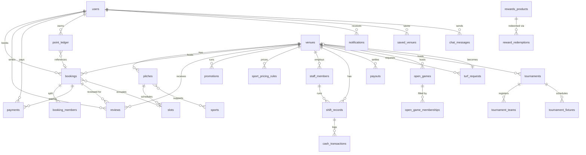

# TurfChai — Database Schema & Architecture (PostgreSQL)

> **Version:** 1.0
> **Target DBMS:** PostgreSQL 15+ (all features require ≥ 15)
> **Scope:** Complete logical & physical schema for the TurfChai turf-booking platform, extracted from the front-end prototype (`player/*`, `host/*`, `owner/*`, `admin/*`, `solo/*`).

---

## Table of Contents

1. [Overview](#1-overview)
2. [Naming & Type Conventions](#2-naming--type-conventions)
3. [Entity–Relationship Diagram](#3-entityrelationship-diagram)
4. [Enum (Domain) Types](#4-enum-domain-types)
5. [Core Tables](#5-core-tables)
6. [Venue & Operations Tables](#6-venue--operations-tables)
7. [Booking, Payment & Review Tables](#7-booking-payment--review-tables)
8. [Loyalty & Rewards Tables](#8-loyalty--rewards-tables)
9. [Solo Play (Open Games & LFG) Tables](#9-solo-play-open-games--lfg-tables)
10. [Tournament Tables](#10-tournament-tables)
11. [Staff, Shifts & Payout Tables](#11-staff-shifts--payout-tables)
12. [Admin, Audit & Communication Tables](#12-admin-audit--communication-tables)
13. [Indexing Strategy](#13-indexing-strategy)
14. [Triggers & Functions](#14-triggers--functions)
15. [Business Rules & Constraints Summary](#15-business-rules--constraints-summary)
16. [Security Model (RLS)](#16-security-model-rls)
17. [Migration & Versioning](#17-migration--versioning)

---

## 1. Overview

TurfChai is a sports-turf booking platform operating in Dhaka (BDT / ৳). The schema covers **six workspaces**:

| Workspace | Roles | Primary surfaces |
|---|---|---|
| Player | `player` | Book turfs, split payments, reviews, loyalty, saved venues |
| Solo Player | `solo_player` | Join open games, LFG alerts, reliability score |
| Host | `host` | Run tournaments, multi-pitch reservations |
| Owner | `owner`, venue `staff` | Venue setup, pricing, calendar, staff, shifts, payouts |
| Admin | `admin`, `super_admin` | Turf vetting, user moderation, audit, payouts oversight |
| System | `system` | Background jobs, alerts, audit of automated actions |

### Design principles

1. **Single `users` table** for every actor; venue-level roles live in `staff_members`. Platform roles in `users.role`, venue roles in `staff_members.role`.
2. **Codes over magic strings** — human-facing references (`TC-48291`, `TR-1042`, `TR-CUP-0091`) are stored in dedicated `*_code` columns with unique indexes; internal FKs use `BIGINT` identities.
3. **Money** is always `NUMERIC(12,2)` in BDT. `0.00` preferred over `NULL` for monetary totals.
4. **Timestamps** are `TIMESTAMPTZ` (UTC) everywhere; display formatting is the application's job.
5. **Audit trail** is append-only (`activity_logs`); core money/status tables are never hard-deleted.
6. **Soft delete** via `deleted_at` where GDPR/regulatory removal is allowed; money tables use `cancelled`/`reversed` instead.
7. **Enums** are PostgreSQL native `ENUM` types for stable, constrained, single-source-of-truth values. Where values are user-extensible (amenities, sports), use lookup tables or `JSONB`.
8. **Row-Level Security** (RLS) recommended so a user's scope (their venues, their bookings) is enforced at the database layer.

---

## 2. Naming & Type Conventions

### 2.1 Naming

| Item | Convention | Example |
|---|---|---|
| Table names | `snake_case`, plural | `bookings`, `point_ledger` |
| Column names | `snake_case`, singular | `start_time`, `total_amount` |
| Primary keys | `id` | `id BIGINT GENERATED ALWAYS AS IDENTITY PRIMARY KEY` |
| Foreign keys | `<singular_table>_id` | `venue_id`, `pitch_id` |
| Join tables | `a_b` (alphabetical) | `pitch_sports` |
| Enum type names | descriptive, singular | `booking_status`, `payment_method` |
| Check constraints | `ck_<table>_<description>` | `ck_payments_amount_positive` |
| Indexes | `idx_<table>_<column(s)>` | `idx_bookings_slot_id` |
| Partial/unique indexes | `uq_<table>_<column(s)>` | `uq_bookings_booking_code` |
| Timestamp columns | `*_at` | `created_at`, `paid_at`, `cancelled_at` |

### 2.2 Data types

| Domain | Type |
|---|---|
| Surrogate ID | `BIGINT GENERATED ALWAYS AS IDENTITY` |
| User UUID (external, optional) | `UUID DEFAULT gen_random_uuid()` |
| Short text | `VARCHAR(100)` |
| Long text / notes | `TEXT` |
| Currency (BDT) | `NUMERIC(12,2)` |
| Percentage | `NUMERIC(5,2)` |
| Money-adjacent counters | `INTEGER` |
| Coordinates | `NUMERIC(10,7)` (lat), `NUMERIC(10,7)` (lng) |
| Distances | `NUMERIC(6,2)` km |
| Dates | `DATE` |
| Clock times | `TIME` |
| Instants | `TIMESTAMPTZ` |
| Booleans | `BOOLEAN` |
| Flexible attribute sets | `JSONB` (validated in app layer or via CHECK + `jsonb_typeof`) |
| Rating values | `SMALLINT` with `CHECK (col BETWEEN 1 AND 5)` |
| Multi-value fixed sets | `ENUM[]` (array of enum) |

### 2.3 Default audit columns (present on almost every row)

```sql
created_at TIMESTAMPTZ NOT NULL DEFAULT now(),
updated_at TIMESTAMPTZ NOT NULL DEFAULT now()
```

`updated_at` is maintained by the shared trigger `set_updated_at` (see [§14](#14-triggers--functions)).

---

## 3. Entity–Relationship Diagram



---

## 4. Enum (Domain) Types

```sql
-- ---------------------------------------------------------------------------
-- Platform & identity
-- ---------------------------------------------------------------------------
CREATE TYPE role_type AS ENUM (
    'player', 'solo_player', 'host', 'owner', 'admin', 'super_admin'
);

CREATE TYPE user_status AS ENUM (
    'active', 'pending', 'suspended', 'deleted'
);

CREATE TYPE onboarding_state AS ENUM (
    'verify', 'about_you', 'play_style', 'completed'
);

CREATE TYPE skill_level AS ENUM (
    'beginner', 'intermediate', 'advanced', 'all_levels'
);

-- ---------------------------------------------------------------------------
-- Venues & pitches
-- ---------------------------------------------------------------------------
CREATE TYPE venue_status AS ENUM (
    'draft', 'pending_listing', 'live', 'suspended', 'rejected'
);

CREATE TYPE deposit_policy AS ENUM (
    'full_only', 'thirty_percent', 'fifty_percent'
);

CREATE TYPE cancel_policy AS ENUM (
    'free_24h_50_6h',     -- 100% refund >= 24h, 50% 6-24h, 0% < 6h
    'flexible_6h',        -- 100% refund >= 6h, 0% below
    'strict_no_refund'
);

CREATE TYPE refund_tier AS ENUM (
    'full',     -- >= 24h before start  -> 100%
    'half',     -- 6h - 24h before      -> 50%
    'none'      -- < 6h before          -> 0%
);

CREATE TYPE pitch_format AS ENUM (
    '5_a_side', '6_a_side', '7_a_side', '9_a_side', '11_a_side'
);

CREATE TYPE slot_status AS ENUM (
    'available', 'booked', 'held', 'blocked'
);

CREATE TYPE slot_source AS ENUM (
    'online', 'walk_in', 'phone'
);

CREATE TYPE missed_slot_reason AS ENUM (
    'unbooked', 'off_peak_unbooked', 'rainy', 'late_cancellation',
    'jumma_time', 'no_show'
);

-- ---------------------------------------------------------------------------
-- Bookings & payments
-- ---------------------------------------------------------------------------
CREATE TYPE booking_status AS ENUM (
    'pending', 'confirmed', 'paid', 'partially_paid',
    'completed', 'no_show', 'cancelled', 'refunded'
);

CREATE TYPE booking_source AS ENUM (
    'online', 'walk_in', 'phone'
);

CREATE TYPE confirmation_type AS ENUM (
    'instant', 'manual'
);

CREATE TYPE cancellation_reason AS ENUM (
    'not_enough_players', 'weather', 'found_another_venue',
    'schedule_conflict', 'other'
);

CREATE TYPE payment_method AS ENUM (
    'bkash', 'nagad', 'card', 'cash'
);

CREATE TYPE payment_status AS ENUM (
    'initiated', 'pending', 'success', 'failed', 'refunded', 'reversed'
);

CREATE TYPE payment_type AS ENUM (
    'booking', 'split_share', 'open_game', 'tournament_deposit',
    'tournament_balance', 'refund', 'wallet'
);

CREATE TYPE member_payment_status AS ENUM (
    'paid', 'pending', 'invited', 'unassigned'
);

-- ---------------------------------------------------------------------------
-- Loyalty
-- ---------------------------------------------------------------------------
CREATE TYPE tier_name AS ENUM ('silver', 'gold', 'platinum');

CREATE TYPE point_reason AS ENUM (
    'booking', 'attended_match', 'review', 'profile_completion',
    'joined_open_game', 'off_peak_bonus', 'monthly_bonus',
    'redemption', 'adjustment', 'expiry'
);

CREATE TYPE reward_kind AS ENUM (
    'wallet_credit',      -- ৳ off voucher credited to wallet
    'free_slot',          -- free 1-hr slot
    'discount_next',      -- % off next booking
    'priority_pass'       -- priority booking pass
);

-- ---------------------------------------------------------------------------
-- Solo play
-- ---------------------------------------------------------------------------
CREATE TYPE open_game_status AS ENUM (
    'open', 'almost_full', 'full', 'completed', 'cancelled'
);

CREATE TYPE game_membership_status AS ENUM (
    'requested', 'joined', 'paid', 'cancelled'
);

CREATE TYPE lfg_status AS ENUM (
    'active', 'paused', 'expired'
);

-- ---------------------------------------------------------------------------
-- Tournaments
-- ---------------------------------------------------------------------------
CREATE TYPE tournament_format AS ENUM (
    '5_a_side', '6_a_side', '7_a_side', 'knockout'
);

CREATE TYPE tournament_status AS ENUM (
    'draft', 'published', 'confirmed', 'completed', 'cancelled'
);

CREATE TYPE tournament_privacy AS ENUM (
    'open', 'invite_only'
);

CREATE TYPE team_join_status AS ENUM (
    'requested', 'invited', 'joined', 'approved', 'rejected'
);

CREATE TYPE team_payment_status AS ENUM (
    'due', 'partial', 'paid'
);

CREATE TYPE fixture_status AS ENUM (
    'scheduled', 'live', 'completed'
);

-- ---------------------------------------------------------------------------
-- Staff, shifts, payouts
-- ---------------------------------------------------------------------------
CREATE TYPE staff_role AS ENUM (
    'owner', 'co_owner', 'manager', 'front_desk', 'accountant'
);

CREATE TYPE staff_status AS ENUM (
    'invited', 'active', 'disabled'
);

CREATE TYPE shift_status AS ENUM (
    'open', 'closed', 'balanced', 'discrepancy'
);

CREATE TYPE payout_status AS ENUM (
    'scheduled', 'in_transit', 'settled', 'failed'
);

CREATE TYPE payout_anomaly_flag AS ENUM (
    'none', 'suspected', 'confirmed'
);

-- ---------------------------------------------------------------------------
-- Admin / vetting / audit
-- ---------------------------------------------------------------------------
CREATE TYPE turf_request_status AS ENUM (
    'pending', 'approved', 'rejected', 'changes_requested'
);

CREATE TYPE review_status AS ENUM (
    'pending', 'published', 'flagged'
);

CREATE TYPE notification_type AS ENUM (
    'booking_confirmed', 'split_payment_received', 'lfg_match_found',
    'points_credited', 'payment_reminder', 'payout_settled',
    'tournament_update', 'system'
);

CREATE TYPE audit_action AS ENUM (
    'approved', 'rejected', 'suspended_user', 'refund_approved',
    'flag_raised', 'signed_in', 'updated_turf', 'requested_changes',
    'payment_reconciled', 'payout_failed'
);

CREATE TYPE audit_target_type AS ENUM (
    'turf_request', 'booking', 'venue', 'user', 'payout', 'payment'
);

CREATE TYPE actor_type AS ENUM (
    'admin', 'system', 'owner', 'staff', 'player'
);
```

---

## 5. Core Tables

### 5.1 `users`

Single table for all actors (player, solo player, host, owner, admin, super admin).

```sql
CREATE TABLE users (
    id                  BIGINT GENERATED ALWAYS AS IDENTITY PRIMARY KEY,
    public_id           UUID NOT NULL DEFAULT gen_random_uuid() UNIQUE,
    full_name           VARCHAR(100) NOT NULL,
    email               CITEXT NOT NULL UNIQUE,
    phone               VARCHAR(20) NOT NULL UNIQUE,
    password_hash       TEXT NOT NULL,
    role                role_type NOT NULL DEFAULT 'player',
    status              user_status NOT NULL DEFAULT 'pending',
    area                VARCHAR(100),
    avatar_url          TEXT,
    avatar_initials     VARCHAR(4),
    bio                 TEXT,

    -- Reliability & moderation
    reliability_score   SMALLINT NOT NULL DEFAULT 100
                        CHECK (reliability_score BETWEEN 0 AND 100),
    games_attended      INTEGER NOT NULL DEFAULT 0,
    games_no_show       INTEGER NOT NULL DEFAULT 0,
    is_suspended        BOOLEAN NOT NULL DEFAULT FALSE,
    suspension_reason   TEXT,
    suspended_until     TIMESTAMPTZ,

    -- Security
    two_factor_enabled  BOOLEAN NOT NULL DEFAULT FALSE,
    two_factor_secret   TEXT,
    email_verified_at   TIMESTAMPTZ,
    phone_verified_at   TIMESTAMPTZ,
    last_sign_in_at     TIMESTAMPTZ,
    last_sign_in_ip     INET,
    failed_login_count  SMALLINT NOT NULL DEFAULT 0,
    locked_until        TIMESTAMPTZ,

    -- Onboarding & preferences
    onboarding_state    onboarding_state NOT NULL DEFAULT 'verify',
    play_style          skill_level,
    preferred_sports    VARCHAR(50)[],        -- e.g. {'Football','Futsal'}
    preferred_areas     VARCHAR(100)[],
    preferred_time_windows JSONB,             -- [{"from":"06:00","to":"22:00"}]

    created_at          TIMESTAMPTZ NOT NULL DEFAULT now(),
    updated_at          TIMESTAMPTZ NOT NULL DEFAULT now(),
    deleted_at          TIMESTAMPTZ
);

CREATE INDEX idx_users_role_status ON users (role, status);
CREATE INDEX idx_users_area ON users (area);
CREATE INDEX idx_users_lower_email ON users (lower(email));
CREATE INDEX idx_users_reliability ON users (reliability_score DESC)
    WHERE status = 'active';
```

> **Notes**
> - `CITEXT` requires the `citext` extension (`CREATE EXTENSION citext;`).
> - A user can hold **both** a platform role (`users.role`) and venue staff roles (`staff_members.role`); e.g. an `owner` who is also a `player`.
> - `public_id` is the value shared with clients; `id` stays internal.

---

## 6. Venue & Operations Tables

### 6.1 `venues`

```sql
CREATE TABLE venues (
    id                  BIGINT GENERATED ALWAYS AS IDENTITY PRIMARY KEY,
    venue_code          VARCHAR(12) NOT NULL UNIQUE,        -- e.g. 'V-0044'
    name                VARCHAR(120) NOT NULL,
    owner_user_id       BIGINT NOT NULL REFERENCES users(id),
    status              venue_status NOT NULL DEFAULT 'draft',

    -- Location
    address             VARCHAR(255) NOT NULL,
    area                VARCHAR(100) NOT NULL,
    lat                 NUMERIC(10,7),
    lng                 NUMERIC(10,7),

    -- Reputation (denormalised, maintained by triggers)
    rating_avg          NUMERIC(3,2) NOT NULL DEFAULT 0.00 CHECK (rating_avg BETWEEN 0 AND 5),
    review_count        INTEGER NOT NULL DEFAULT 0 CHECK (review_count >= 0),
    saved_count         INTEGER NOT NULL DEFAULT 0,

    -- Badges & discovery
    is_verified         BOOLEAN NOT NULL DEFAULT FALSE,
    is_tournament_ready BOOLEAN NOT NULL DEFAULT FALSE,
    has_promotion       BOOLEAN NOT NULL DEFAULT FALSE,
    promotion_label     VARCHAR(100),
    photos              JSONB NOT NULL DEFAULT '[]',
    amenities           JSONB NOT NULL DEFAULT '[]',
    -- amenities items: {"key":"floodlights","label":"Floodlights"}

    -- Operations
    rules               TEXT,
    operating_hours     JSONB NOT NULL DEFAULT '{"open":"06:00","close":"23:00"}',
    default_buffer_min  SMALLINT NOT NULL DEFAULT 10,
    deposit_policy      deposit_policy NOT NULL DEFAULT 'full_only',
    cancel_policy       cancel_policy NOT NULL DEFAULT 'free_24h_50_6h',
    allow_split_payment BOOLEAN NOT NULL DEFAULT TRUE,
    minimum_refund_hours SMALLINT NOT NULL DEFAULT 6,
    refund_window_full_hours SMALLINT NOT NULL DEFAULT 24,

    -- Contacts & payouts
    contact_phone       VARCHAR(20),
    contact_email       CITEXT,
    bank_account        JSONB,   -- {"bank":"City Bank","account":"...2214","holder":""}

    -- Lifecycle
    created_at          TIMESTAMPTZ NOT NULL DEFAULT now(),
    updated_at          TIMESTAMPTZ NOT NULL DEFAULT now(),
    deleted_at          TIMESTAMPTZ
);

CREATE INDEX idx_venues_area_status ON venues (area, status);
CREATE INDEX idx_venues_owner ON venues (owner_user_id);
CREATE INDEX idx_venues_live_location ON venues (lat, lng) WHERE status = 'live';
CREATE INDEX idx_venues_rating ON venues (rating_avg DESC) WHERE status = 'live';
```

### 6.2 `sports`

```sql
CREATE TABLE sports (
    id          BIGINT GENERATED ALWAYS AS IDENTITY PRIMARY KEY,
    name        VARCHAR(50) NOT NULL UNIQUE,   -- Football, Cricket, Futsal...
    slug        VARCHAR(50) NOT NULL UNIQUE,
    icon_url    TEXT,
    is_active   BOOLEAN NOT NULL DEFAULT TRUE
);

INSERT INTO sports (name, slug) VALUES
    ('Football', 'football'),
    ('Cricket',  'cricket'),
    ('Futsal',   'futsal'),
    ('Badminton','badminton'),
    ('Basketball','basketball'),
    ('Volleyball','volleyball');
```

### 6.3 `pitches` (individual turf / court)

```sql
CREATE TABLE pitches (
    id              BIGINT GENERATED ALWAYS AS IDENTITY PRIMARY KEY,
    venue_id        BIGINT NOT NULL REFERENCES venues(id) ON DELETE CASCADE,
    name            VARCHAR(80) NOT NULL,                  -- 'Pitch 2 · 7-a-side'
    surface_type    VARCHAR(100),                          -- 'FIFA-grade Artificial Grass'
    surface_detail  VARCHAR(255),                          -- 'Relaid Jan 2026 · shock pad'
    dimensions      VARCHAR(40),                           -- '30×50 m'
    lighting        VARCHAR(120),                          -- '200-lux LED Floodlights'
    format          pitch_format,
    max_players     INTEGER NOT NULL DEFAULT 10 CHECK (max_players > 0),
    indoor          BOOLEAN NOT NULL DEFAULT FALSE,
    is_active       BOOLEAN NOT NULL DEFAULT TRUE,
    created_at      TIMESTAMPTZ NOT NULL DEFAULT now(),
    updated_at      TIMESTAMPTZ NOT NULL DEFAULT now(),

    CONSTRAINT uq_pitches_venue_name UNIQUE (venue_id, name)
);

CREATE INDEX idx_pitches_venue ON pitches (venue_id) WHERE is_active = TRUE;
```

### 6.4 `pitch_sports` (join table)

```sql
CREATE TABLE pitch_sports (
    pitch_id    BIGINT NOT NULL REFERENCES pitches(id) ON DELETE CASCADE,
    sport_id    BIGINT NOT NULL REFERENCES sports(id) ON DELETE CASCADE,
    PRIMARY KEY (pitch_id, sport_id)
);
```

### 6.5 `sport_pricing_rules`

Defines slot duration, buffer and peak/off-peak pricing per (venue, sport). Mirrors the owner "slot pricing" modal.

```sql
CREATE TABLE sport_pricing_rules (
    id                  BIGINT GENERATED ALWAYS AS IDENTITY PRIMARY KEY,
    venue_id            BIGINT NOT NULL REFERENCES venues(id) ON DELETE CASCADE,
    sport_id            BIGINT NOT NULL REFERENCES sports(id),
    slot_duration_min   INTEGER NOT NULL CHECK (slot_duration_min IN (30, 40, 60, 90, 120)),
    buffer_min          INTEGER NOT NULL DEFAULT 10 CHECK (buffer_min IN (5, 10, 15)),
    window_type         VARCHAR(12) NOT NULL CHECK (window_type IN ('off_peak','peak','full_day')),
    rate                NUMERIC(12,2) NOT NULL CHECK (rate >= 0),
    window_start        TIME NOT NULL,      -- e.g. 06:00 for off-peak
    window_end          TIME NOT NULL,      -- e.g. 16:00 for off-peak
    days_of_week        SMALLINT[] NOT NULL, -- ISO 1..7 (Mon..Sun); NULL = every day
    is_active           BOOLEAN NOT NULL DEFAULT TRUE,
    created_at          TIMESTAMPTZ NOT NULL DEFAULT now(),
    updated_at          TIMESTAMPTZ NOT NULL DEFAULT now(),

    CONSTRAINT uq_pricing_venue_sport_window UNIQUE (venue_id, sport_id, window_type)
);

CREATE INDEX idx_pricing_venue_sport ON sport_pricing_rules (venue_id, sport_id)
    WHERE is_active = TRUE;
```

### 6.6 `slots` (scheduled sellable time-slices of a pitch)

```sql
CREATE TABLE slots (
    id               BIGINT GENERATED ALWAYS AS IDENTITY PRIMARY KEY,
    venue_id         BIGINT NOT NULL REFERENCES venues(id),
    pitch_id         BIGINT NOT NULL REFERENCES pitches(id) ON DELETE CASCADE,
    slot_date        DATE NOT NULL,
    start_time       TIME NOT NULL,
    end_time         TIME NOT NULL,
    price            NUMERIC(12,2) NOT NULL CHECK (price >= 0),
    status           slot_status NOT NULL DEFAULT 'available',
    held_by_user_id  BIGINT REFERENCES users(id),
    hold_expires_at  TIMESTAMPTZ,
    source           slot_source NOT NULL DEFAULT 'online',
    created_at       TIMESTAMPTZ NOT NULL DEFAULT now(),
    updated_at       TIMESTAMPTZ NOT NULL DEFAULT now(),

    CONSTRAINT ck_slots_valid_window CHECK (end_time > start_time),
    CONSTRAINT ck_slots_hold_consistent CHECK (
        (status = 'held' AND held_by_user_id IS NOT NULL AND hold_expires_at IS NOT NULL)
        OR (status <> 'held' AND held_by_user_id IS NULL)
    ),
    CONSTRAINT uq_slots_pitch_window UNIQUE (pitch_id, slot_date, start_time, end_time)
);

CREATE INDEX idx_slots_availability
    ON slots (pitch_id, slot_date) WHERE status = 'available';
CREATE INDEX idx_slots_hold_cleanup
    ON slots (hold_expires_at) WHERE status = 'held';
CREATE INDEX idx_slots_venue_date ON slots (venue_id, slot_date);
```

> **Slot lifecycle:** `available → held` (when a user starts checkout, 5-minute lock) `→ booked` (on confirmed payment) `→ blocked` (owner maintenance/unavailable). Held slots that expire return to `available` via the cleanup job in [§14.4](#144-hold-expiry-cleanup).

---

## 7. Booking, Payment & Review Tables

### 7.1 `bookings`

```sql
CREATE TABLE bookings (
    id                  BIGINT GENERATED ALWAYS AS IDENTITY PRIMARY KEY,
    booking_code        VARCHAR(14) NOT NULL UNIQUE,   -- e.g. 'TC-48291'
    booker_user_id      BIGINT NOT NULL REFERENCES users(id),
    venue_id            BIGINT NOT NULL REFERENCES venues(id),
    pitch_id            BIGINT NOT NULL REFERENCES pitches(id),
    slot_id             BIGINT NOT NULL REFERENCES slots(id),

    -- Schedule (snapshot at booking time)
    booking_date        DATE NOT NULL,
    start_time          TIME NOT NULL,
    end_time            TIME NOT NULL,

    -- Money
    gross_amount        NUMERIC(12,2) NOT NULL CHECK (gross_amount >= 0),
    discount_amount     NUMERIC(12,2) NOT NULL DEFAULT 0.00 CHECK (discount_amount >= 0),
    promotion_id        BIGINT REFERENCES promotions(id),
    loyalty_points_used INTEGER NOT NULL DEFAULT 0,
    net_amount          NUMERIC(12,2) NOT NULL CHECK (net_amount >= 0),
    amount_paid         NUMERIC(12,2) NOT NULL DEFAULT 0.00 CHECK (amount_paid >= 0),

    -- Flags & workflow
    status              booking_status NOT NULL DEFAULT 'pending',
    confirmation_type   confirmation_type NOT NULL DEFAULT 'instant',
    source              booking_source NOT NULL DEFAULT 'online',
    cancel_policy_snapshot cancel_policy,
    refund_tier         refund_tier,

    -- Split payment
    split_enabled       BOOLEAN NOT NULL DEFAULT FALSE,
    split_deadline      TIMESTAMPTZ,
    split_total_paid    NUMERIC(12,2) NOT NULL DEFAULT 0.00,
    split_remaining     NUMERIC(12,2) NOT NULL DEFAULT 0.00,

    -- Cancellation
    cancel_reason       cancellation_reason,
    cancel_note         TEXT,
    cancelled_at        TIMESTAMPTZ,
    cancelled_by_user_id BIGINT REFERENCES users(id),

    -- Lifecycle
    confirmed_at        TIMESTAMPTZ,
    checked_in_at       TIMESTAMPTZ,
    completed_at        TIMESTAMPTZ,
    created_at          TIMESTAMPTZ NOT NULL DEFAULT now(),
    updated_at          TIMESTAMPTZ NOT NULL DEFAULT now(),

    CONSTRAINT ck_bookings_window CHECK (end_time > start_time),
    CONSTRAINT ck_bookings_money CHECK (amount_paid <= net_amount),
    CONSTRAINT ck_bookings_split CHECK (
        (split_enabled AND split_deadline IS NOT NULL AND split_remaining >= 0)
        OR (NOT split_enabled AND split_deadline IS NULL AND split_remaining = 0)
    )
);

CREATE INDEX idx_bookings_booker ON bookings (booker_user_id, booking_date DESC);
CREATE INDEX idx_bookings_venue_date ON bookings (venue_id, booking_date);
CREATE INDEX idx_bookings_slot ON bookings (slot_id);
CREATE INDEX idx_bookings_status_due
    ON bookings (booking_date, start_time) WHERE status IN ('confirmed','paid','partially_paid');
CREATE INDEX idx_bookings_split_deadline
    ON bookings (split_deadline) WHERE split_enabled = TRUE AND status IN ('confirmed','paid','partially_paid');
```

> **Split-payment invariant:** `amount_paid` + `split_remaining` = `net_amount`; when no split, `split_remaining = 0`.

### 7.2 `booking_members`

```sql
CREATE TABLE booking_members (
    id              BIGINT GENERATED ALWAYS AS IDENTITY PRIMARY KEY,
    booking_id      BIGINT NOT NULL REFERENCES bookings(id) ON DELETE CASCADE,
    user_id         BIGINT REFERENCES users(id),        -- NULL => unassigned share
    share_amount    NUMERIC(12,2) NOT NULL CHECK (share_amount >= 0),
    payment_status  member_payment_status NOT NULL DEFAULT 'pending',
    payment_method  payment_method,
    is_captain      BOOLEAN NOT NULL DEFAULT FALSE,
    invited_at      TIMESTAMPTZ,
    paid_at         TIMESTAMPTZ,
    created_at      TIMESTAMPTZ NOT NULL DEFAULT now(),
    updated_at      TIMESTAMPTZ NOT NULL DEFAULT now(),

    CONSTRAINT uq_booking_member UNIQUE (booking_id, user_id)
    DEFERRABLE INITIALLY IMMEDIATE,
    CONSTRAINT ck_booking_member_share CHECK (share_amount > 0)
);

CREATE INDEX idx_booking_members_user ON booking_members (user_id);
CREATE INDEX idx_booking_members_status
    ON booking_members (booking_id, payment_status) WHERE payment_status <> 'paid';
```

### 7.3 `payments`

Covers all money movements: full booking payment, split shares, open-game entry, tournament deposits, refunds and wallet redemptions.

```sql
CREATE TABLE payments (
    id                  BIGINT GENERATED ALWAYS AS IDENTITY PRIMARY KEY,
    txn_reference       VARCHAR(30) NOT NULL UNIQUE,   -- e.g. '9K3L27', 'R-2210'
    user_id             BIGINT NOT NULL REFERENCES users(id),
    booking_id          BIGINT REFERENCES bookings(id),
    booking_member_id   BIGINT REFERENCES booking_members(id),
    open_game_id        BIGINT REFERENCES open_games(id),
    tournament_id       BIGINT REFERENCES tournaments(id),
    type                payment_type NOT NULL,
    amount              NUMERIC(12,2) NOT NULL CHECK (amount > 0),
    currency            CHAR(3) NOT NULL DEFAULT 'BDT',
    method              payment_method NOT NULL,
    provider            VARCHAR(30),                     -- 'bKash','Nagad','SSLCommerz'...
    provider_txn_id     VARCHAR(80),
    status              payment_status NOT NULL DEFAULT 'initiated',
    failure_reason      VARCHAR(255),
    hold_until          TIMESTAMPTZ,                     -- 5-min slot hold
    is_reward_wallet_payment BOOLEAN NOT NULL DEFAULT FALSE,
    matched_to_booking_id BIGINT REFERENCES bookings(id), -- manual reconciliation
    paid_at             TIMESTAMPTZ,
    refund_of_payment_id BIGINT REFERENCES payments(id),
    created_at          TIMESTAMPTZ NOT NULL DEFAULT now(),
    updated_at          TIMESTAMPTZ NOT NULL DEFAULT now(),

    CONSTRAINT ck_payments_context CHECK (
        (type IN ('booking','split_share') AND booking_id IS NOT NULL)
        OR (type = 'open_game' AND open_game_id IS NOT NULL)
        OR (type IN ('tournament_deposit','tournament_balance') AND tournament_id IS NOT NULL)
        OR (type = 'refund')
        OR (type = 'wallet' AND booking_id IS NULL)
    )
);

CREATE INDEX idx_payments_user ON payments (user_id, created_at DESC);
CREATE INDEX idx_payments_booking ON payments (booking_id);
CREATE INDEX idx_payments_provider_txn ON payments (provider_txn_id) WHERE provider_txn_id IS NOT NULL;
CREATE INDEX idx_payments_unmatched
    ON payments (created_at) WHERE status = 'success' AND booking_id IS NULL AND type = 'booking';
CREATE INDEX idx_payments_hold_until
    ON payments (hold_until) WHERE status = 'initiated';
```

> **Reconciliation:** a successful incoming `type = 'booking'` payment with no `booking_id` is *unmatched* and visible in the owner reconciliation screen; an admin links it via `matched_to_booking_id`.

### 7.4 `reviews`

```sql
CREATE TABLE reviews (
    id              BIGINT GENERATED ALWAYS AS IDENTITY PRIMARY KEY,
    booking_id      BIGINT NOT NULL REFERENCES bookings(id),
    user_id         BIGINT NOT NULL REFERENCES users(id),
    venue_id        BIGINT NOT NULL REFERENCES venues(id),
    overall_rating  SMALLINT NOT NULL CHECK (overall_rating BETWEEN 1 AND 5),
    sub_ratings     JSONB NOT NULL DEFAULT '{}',
    -- sub_ratings: {"surface":5,"lighting":4,"cleanliness":5,"safety":5,"youth_friendly":4}
    comment         TEXT,
    tags            VARCHAR(30)[] NOT NULL DEFAULT '{}',  -- {'verified_booking','parent'}
    status          review_status NOT NULL DEFAULT 'pending',
    owner_reply     TEXT,
    owner_replied_at TIMESTAMPTZ,
    reported_count  INTEGER NOT NULL DEFAULT 0,
    reported_reason TEXT,
    created_at      TIMESTAMPTZ NOT NULL DEFAULT now(),
    updated_at      TIMESTAMPTZ NOT NULL DEFAULT now(),

    CONSTRAINT uq_reviews_booking UNIQUE (booking_id, user_id)
);

CREATE INDEX idx_reviews_venue_rating ON reviews (venue_id, status)
    WHERE status = 'published';
CREATE INDEX idx_reviews_user ON reviews (user_id);
```

> `venues.rating_avg` and `venues.review_count` are recomputed by trigger on insert/update/delete of published reviews.

### 7.5 `promotions`

```sql
CREATE TABLE promotions (
    id                    BIGINT GENERATED ALWAYS AS IDENTITY PRIMARY KEY,
    venue_id              BIGINT NOT NULL REFERENCES venues(id) ON DELETE CASCADE,
    title                 VARCHAR(120) NOT NULL,     -- 'Buy 5 get 1 free'
    kind                  VARCHAR(20) NOT NULL
                          CHECK (kind IN ('discount_percent','buy_x_get_y','off_peak','flat')),
    value                 NUMERIC(12,2),             -- 20 (%), 10 (৳ flat), 5 (buy), 1 (get)
    conditions            JSONB NOT NULL DEFAULT '{}',
    -- conditions: {"days":["Sun","Mon"],"from":"16:00","to":"23:00","sports":[1,2]}
    auto_apply_at_checkout BOOLEAN NOT NULL DEFAULT TRUE,
    starts_at             TIMESTAMPTZ NOT NULL,
    ends_at               TIMESTAMPTZ NOT NULL,
    is_active             BOOLEAN NOT NULL DEFAULT TRUE,
    created_at            TIMESTAMPTZ NOT NULL DEFAULT now(),
    updated_at            TIMESTAMPTZ NOT NULL DEFAULT now(),

    CONSTRAINT ck_promotions_window CHECK (ends_at > starts_at),
    CONSTRAINT ck_promotions_value CHECK (value IS NULL OR value > 0)
);

CREATE INDEX idx_promotions_active ON promotions (venue_id, starts_at, ends_at)
    WHERE is_active = TRUE;
```

> A venue-wide active promotion sets `venues.has_promotion = TRUE` and `venues.promotion_label` via trigger (see [§14.2](#142-venue-promotion-badge)).

---

## 8. Loyalty & Rewards Tables

### 8.1 `loyalty_tiers`

```sql
CREATE TABLE loyalty_tiers (
    id                  BIGINT GENERATED ALWAYS AS IDENTITY PRIMARY KEY,
    name                tier_name NOT NULL UNIQUE,
    min_points          INTEGER NOT NULL,
    discount_percent    NUMERIC(5,2) NOT NULL DEFAULT 0.00,
    perks               JSONB NOT NULL DEFAULT '{}',
    -- perks: {"priority_booking":true,"free_extension_min":30}
    sort_order          SMALLINT NOT NULL UNIQUE
);

INSERT INTO loyalty_tiers (name, min_points, discount_percent, perks, sort_order) VALUES
    ('silver',   0,     0.00, '{"priority_booking":false,"free_extension_min":0}',  1),
    ('gold',  1000,    10.00, '{"priority_booking":false,"free_extension_min":30}', 2),
    ('platinum',2000,   15.00, '{"priority_booking":true, "free_extension_min":30}', 3);
```

### 8.2 `reward_products`

```sql
CREATE TABLE reward_products (
    id                BIGINT GENERATED ALWAYS AS IDENTITY PRIMARY KEY,
    name              VARCHAR(120) NOT NULL,
    kind              reward_kind NOT NULL,
    cost_points       INTEGER NOT NULL CHECK (cost_points > 0),
    value             NUMERIC(12,2),                 -- ৳50, ৳150, 10 (%), 1 (hr)
    description       TEXT,
    is_active         BOOLEAN NOT NULL DEFAULT TRUE
);

INSERT INTO reward_products (name, kind, cost_points, value) VALUES
    ('৳50 off',             'wallet_credit',   500,  50.00),
    ('৳150 off',            'wallet_credit',  1000, 150.00),
    ('Free 1-hr slot',      'free_slot',      2000,   1.00),
    ('10% off next booking','discount_next',  2500,  10.00),
    ('Priority Booking Pass','priority_pass', 3000,  NULL);
```

### 8.3 `point_ledger`

Append-only log of every point change. `users.points_balance` is a maintained denormalised column.

```sql
CREATE TABLE point_ledger (
    id              BIGINT GENERATED ALWAYS AS IDENTITY PRIMARY KEY,
    user_id         BIGINT NOT NULL REFERENCES users(id),
    delta           INTEGER NOT NULL,             -- positive = earn, negative = spend
    reason          point_reason NOT NULL,
    reference_booking_id  BIGINT REFERENCES bookings(id),
    reference_open_game_id BIGINT REFERENCES open_games(id),
    reference_reward_id   BIGINT REFERENCES reward_products(id),
    balance_after   INTEGER NOT NULL,
    expires_at      TIMESTAMPTZ,                   -- point batch expiry
    note            VARCHAR(255),
    created_at      TIMESTAMPTZ NOT NULL DEFAULT now(),

    CONSTRAINT ck_point_ledger_delta CHECK (delta <> 0)
);

CREATE INDEX idx_point_ledger_user ON point_ledger (user_id, created_at DESC);
CREATE INDEX idx_point_ledger_expiry
    ON point_ledger (expires_at) WHERE expires_at IS NOT NULL;
```

> **Invariant:** the latest `point_ledger.balance_after` for a user must equal `users.points_balance`. This is enforced by the earning trigger and a reconciliation job.

### 8.4 `reward_redemptions`

```sql
CREATE TABLE reward_redemptions (
    id              BIGINT GENERATED ALWAYS AS IDENTITY PRIMARY KEY,
    user_id         BIGINT NOT NULL REFERENCES users(id),
    reward_id       BIGINT NOT NULL REFERENCES reward_products(id),
    cost_points     INTEGER NOT NULL,
    status          VARCHAR(20) NOT NULL DEFAULT 'issued'
                    CHECK (status IN ('issued','applied','expired','voided')),
    wallet_credit_amount NUMERIC(12,2),
    applied_to_booking_id BIGINT REFERENCES bookings(id),
    created_at      TIMESTAMPTZ NOT NULL DEFAULT now(),
    expires_at      TIMESTAMPTZ
);

CREATE INDEX idx_reward_redemptions_user
    ON reward_redemptions (user_id, status);
```

### 8.5 `wallet_transactions`

Money wallet (৳) — reward credits land here and are applied at checkout.

```sql
CREATE TABLE wallet_transactions (
    id            BIGINT GENERATED ALWAYS AS IDENTITY PRIMARY KEY,
    user_id       BIGINT NOT NULL REFERENCES users(id),
    delta         NUMERIC(12,2) NOT NULL CHECK (delta <> 0),
    reason        VARCHAR(30) NOT NULL
                  CHECK (reason IN ('reward_credit','checkout_apply','adjustment','cashout')),
    redemption_id BIGINT REFERENCES reward_redemptions(id),
    booking_id    BIGINT REFERENCES bookings(id),
    balance_after NUMERIC(12,2) NOT NULL,
    created_at    TIMESTAMPTZ NOT NULL DEFAULT now()
);

CREATE INDEX idx_wallet_user ON wallet_transactions (user_id, created_at DESC);
```

> `users.wallet_balance` mirrors the latest `balance_after` for each user.

---

## 9. Solo Play (Open Games & LFG) Tables

### 9.1 `open_games`

```sql
CREATE TABLE open_games (
    id                BIGINT GENERATED ALWAYS AS IDENTITY PRIMARY KEY,
    game_code         VARCHAR(14) NOT NULL UNIQUE,    -- 'OG-7734'
    title             VARCHAR(150) NOT NULL,
    venue_id          BIGINT NOT NULL REFERENCES venues(id),
    pitch_id          BIGINT REFERENCES pitches(id),
    game_date         DATE NOT NULL,
    start_time        TIME NOT NULL,
    end_time          TIME NOT NULL,
    skill_level       skill_level NOT NULL DEFAULT 'all_levels',
    capacity          INTEGER NOT NULL CHECK (capacity BETWEEN 2 AND 50),
    filled_count      INTEGER NOT NULL DEFAULT 0 CHECK (filled_count BETWEEN 0 AND capacity),
    price_per_player  NUMERIC(12,2) NOT NULL CHECK (price_per_player >= 0),
    organizer_user_id BIGINT NOT NULL REFERENCES users(id),
    status            open_game_status NOT NULL DEFAULT 'open',
    minimum_reliability INTEGER NOT NULL DEFAULT 90,
    created_at        TIMESTAMPTZ NOT NULL DEFAULT now(),
    updated_at        TIMESTAMPTZ NOT NULL DEFAULT now(),

    CONSTRAINT ck_open_games_window CHECK (end_time > start_time)
);

CREATE INDEX idx_open_games_live
    ON open_games (game_date, start_time) WHERE status IN ('open','almost_full');
CREATE INDEX idx_open_games_area_date ON open_games (game_date) WHERE status <> 'cancelled';
```

### 9.2 `open_game_memberships`

```sql
CREATE TABLE open_game_memberships (
    id            BIGINT GENERATED ALWAYS AS IDENTITY PRIMARY KEY,
    open_game_id  BIGINT NOT NULL REFERENCES open_games(id) ON DELETE CASCADE,
    user_id       BIGINT NOT NULL REFERENCES users(id),
    payment_id    BIGINT REFERENCES payments(id),
    status        game_membership_status NOT NULL DEFAULT 'requested',
    show_up       BOOLEAN,                       -- NULL until game completes
    joined_at     TIMESTAMPTZ NOT NULL DEFAULT now(),
    created_at    TIMESTAMPTZ NOT NULL DEFAULT now(),
    updated_at    TIMESTAMPTZ NOT NULL DEFAULT now(),

    CONSTRAINT uq_open_game_member UNIQUE (open_game_id, user_id)
);

CREATE INDEX idx_og_members_user ON open_game_memberships (user_id);
```

> `open_games.filled_count` is maintained by a trigger over this table. A membership that completes (`show_up = FALSE`) decrements the user's reliability score and increments `users.games_no_show`; `show_up = TRUE` increments `games_attended`.

### 9.3 `lfg_alerts`

```sql
CREATE TABLE lfg_alerts (
    id              BIGINT GENERATED ALWAYS AS IDENTITY PRIMARY KEY,
    user_id         BIGINT NOT NULL REFERENCES users(id),
    sport_id        BIGINT REFERENCES sports(id),
    area            VARCHAR(100) NOT NULL,
    preferred_days  SMALLINT[] NOT NULL DEFAULT '{}',  -- ISO 1..7
    preferred_from  TIME,
    preferred_to    TIME,
    status          lfg_status NOT NULL DEFAULT 'active',
    last_matched_at TIMESTAMPTZ,
    created_at      TIMESTAMPTZ NOT NULL DEFAULT now(),
    updated_at      TIMESTAMPTZ NOT NULL DEFAULT now(),

    CONSTRAINT ck_lfg_window CHECK (preferred_to IS NULL OR preferred_from IS NULL
                                    OR preferred_to > preferred_from)
);

CREATE INDEX idx_lfg_active
    ON lfg_alerts (area, status) WHERE status = 'active';
```

---

## 10. Tournament Tables

### 10.1 `tournaments`

```sql
CREATE TABLE tournaments (
    id                   BIGINT GENERATED ALWAYS AS IDENTITY PRIMARY KEY,
    tournament_code      VARCHAR(16) NOT NULL UNIQUE,  -- 'TR-CUP-0091'
    name                 VARCHAR(150) NOT NULL,
    host_user_id         BIGINT NOT NULL REFERENCES users(id),
    venue_id             BIGINT NOT NULL REFERENCES venues(id),
    tournament_date      DATE NOT NULL,
    time_window_start    TIME NOT NULL,
    time_window_end      TIME NOT NULL,
    format               tournament_format NOT NULL,
    team_capacity        INTEGER NOT NULL CHECK (team_capacity > 0),
    registered_teams     INTEGER NOT NULL DEFAULT 0,
    entry_fee_per_team   NUMERIC(12,2) NOT NULL CHECK (entry_fee_per_team >= 0),
    prize_pool           NUMERIC(12,2) NOT NULL DEFAULT 0.00,
    privacy              tournament_privacy NOT NULL DEFAULT 'open',
    invite_code          VARCHAR(32) NOT NULL UNIQUE,  -- slug for invite link
    status               tournament_status NOT NULL DEFAULT 'draft',
    pitches_reserved     INTEGER NOT NULL DEFAULT 0,
    slots_reserved       INTEGER NOT NULL DEFAULT 0,
    deposit_amount       NUMERIC(12,2) NOT NULL DEFAULT 0.00,
    balance_due_date     DATE,
    created_at           TIMESTAMPTZ NOT NULL DEFAULT now(),
    updated_at           TIMESTAMPTZ NOT NULL DEFAULT now(),

    CONSTRAINT ck_tournaments_window CHECK (time_window_end > time_window_start)
);

CREATE INDEX idx_tournaments_venue_date ON tournaments (venue_id, tournament_date);
CREATE INDEX idx_tournaments_host ON tournaments (host_user_id);
```

### 10.2 `tournament_teams`

```sql
CREATE TABLE tournament_teams (
    id                BIGINT GENERATED ALWAYS AS IDENTITY PRIMARY KEY,
    tournament_id     BIGINT NOT NULL REFERENCES tournaments(id) ON DELETE CASCADE,
    name              VARCHAR(120) NOT NULL,
    captain_user_id   BIGINT NOT NULL REFERENCES users(id),
    join_status       team_join_status NOT NULL DEFAULT 'requested',
    payment_status    team_payment_status NOT NULL DEFAULT 'due',
    entry_fee_paid    BOOLEAN NOT NULL DEFAULT FALSE,
    balance_due_date  DATE,
    joined_at         TIMESTAMPTZ NOT NULL DEFAULT now(),
    created_at        TIMESTAMPTZ NOT NULL DEFAULT now(),
    updated_at        TIMESTAMPTZ NOT NULL DEFAULT now(),

    CONSTRAINT uq_team_tournament_name UNIQUE (tournament_id, name)
);

CREATE INDEX idx_team_tournament ON tournament_teams (tournament_id);
```

### 10.3 `tournament_fixtures`

```sql
CREATE TABLE tournament_fixtures (
    id            BIGINT GENERATED ALWAYS AS IDENTITY PRIMARY KEY,
    tournament_id BIGINT NOT NULL REFERENCES tournaments(id) ON DELETE CASCADE,
    round_label   VARCHAR(30) NOT NULL,          -- 'R16','Quarterfinals','Final'
    pitch_id      BIGINT REFERENCES pitches(id),
    start_time    TIME NOT NULL,
    team_a_id     BIGINT REFERENCES tournament_teams(id),
    team_b_id     BIGINT REFERENCES tournament_teams(id),
    score_a       SMALLINT,
    score_b       SMALLINT,
    winner_team_id BIGINT REFERENCES tournament_teams(id),
    status        fixture_status NOT NULL DEFAULT 'scheduled',
    created_at    TIMESTAMPTZ NOT NULL DEFAULT now(),
    updated_at    TIMESTAMPTZ NOT NULL DEFAULT now(),

    CONSTRAINT ck_fixtures_distinct_teams CHECK (team_a_id IS DISTINCT FROM team_b_id),
    CONSTRAINT uq_fixtures_tournament_slot UNIQUE (tournament_id, pitch_id, start_time)
);

CREATE INDEX idx_fixtures_tournament ON tournament_fixtures (tournament_id);
```

### 10.4 `tournament_bookings` (multi-pitch reservations)

Links a tournament to the concrete pitch slots it reserves on its date.

```sql
CREATE TABLE tournament_bookings (
    id            BIGINT GENERATED ALWAYS AS IDENTITY PRIMARY KEY,
    tournament_id BIGINT NOT NULL REFERENCES tournaments(id) ON DELETE CASCADE,
    pitch_id      BIGINT NOT NULL REFERENCES pitches(id),
    slot_id       BIGINT NOT NULL REFERENCES slots(id),
    created_at    TIMESTAMPTZ NOT NULL DEFAULT now(),

    CONSTRAINT uq_tournament_booking_slot UNIQUE (tournament_id, slot_id)
);

CREATE INDEX idx_tournament_bookings_tournament ON tournament_bookings (tournament_id);
```

---

## 11. Staff, Shifts & Payout Tables

### 11.1 `staff_members`

Venue-level staff & permissions (Owner, Co-owner, Manager, Front desk, Accountant).

```sql
CREATE TABLE staff_members (
    id           BIGINT GENERATED ALWAYS AS IDENTITY PRIMARY KEY,
    venue_id     BIGINT NOT NULL REFERENCES venues(id) ON DELETE CASCADE,
    user_id      BIGINT NOT NULL REFERENCES users(id),
    invited_by   BIGINT REFERENCES users(id),
    role         staff_role NOT NULL DEFAULT 'front_desk',
    status       staff_status NOT NULL DEFAULT 'invited',
    invite_token VARCHAR(64),
    invite_expires_at TIMESTAMPTZ,
    permissions  JSONB NOT NULL DEFAULT '{}',
    -- permissions: {
    --   "bookings_calendar": true, "log_cash": true, "open_close_shifts": true,
    --   "promotions": false, "refunds": false, "edit_pricing": false, "view_payouts": false
    -- }
    created_at   TIMESTAMPTZ NOT NULL DEFAULT now(),
    updated_at   TIMESTAMPTZ NOT NULL DEFAULT now(),

    CONSTRAINT uq_staff_venue_user UNIQUE (venue_id, user_id)
);

CREATE INDEX idx_staff_venue ON staff_members (venue_id, status);
```

### 11.2 `shift_records`

```sql
CREATE TABLE shift_records (
    id                   BIGINT GENERATED ALWAYS AS IDENTITY PRIMARY KEY,
    venue_id             BIGINT NOT NULL REFERENCES venues(id),
    staff_user_id        BIGINT NOT NULL REFERENCES users(id),
    shift_name           VARCHAR(40) NOT NULL,        -- 'Morning','Afternoon','Evening'
    start_time           TIMESTAMPTZ NOT NULL,
    end_time             TIMESTAMPTZ,
    opening_float        NUMERIC(12,2) NOT NULL DEFAULT 0.00,
    cash_logged          NUMERIC(12,2) NOT NULL DEFAULT 0.00,
    expected_in_drawer   NUMERIC(12,2) NOT NULL DEFAULT 0.00,
    counted_amount       NUMERIC(12,2),
    status               shift_status NOT NULL DEFAULT 'open',
    closing_note         TEXT,
    created_at           TIMESTAMPTZ NOT NULL DEFAULT now(),
    updated_at           TIMESTAMPTZ NOT NULL DEFAULT now(),

    CONSTRAINT ck_shift_time CHECK (end_time IS NULL OR end_time > start_time)
);

CREATE INDEX idx_shifts_venue ON shift_records (venue_id, start_time DESC);
CREATE INDEX idx_shifts_staff ON shift_records (staff_user_id, start_time DESC);
```

### 11.3 `cash_transactions`

Walk-in cash payments and float adjustments logged against a shift.

```sql
CREATE TABLE cash_transactions (
    id               BIGINT GENERATED ALWAYS AS IDENTITY PRIMARY KEY,
    shift_id         BIGINT NOT NULL REFERENCES shift_records(id),
    booking_id       BIGINT REFERENCES bookings(id),
    amount           NUMERIC(12,2) NOT NULL CHECK (amount <> 0),
    direction        VARCHAR(10) NOT NULL CHECK (direction IN ('in','out')),
    note             VARCHAR(255),
    logged_by_user_id BIGINT NOT NULL REFERENCES users(id),
    created_at       TIMESTAMPTZ NOT NULL DEFAULT now()
);

CREATE INDEX idx_cash_shift ON cash_transactions (shift_id);
```

> `shift_records.cash_logged` is maintained by a trigger over `cash_transactions` (`SUM(amount) WHERE direction='in'` − `WHERE direction='out'`).

### 11.4 `payouts`

Venue settlements. Platform fee is 6% of online (non-cash) revenue only.

```sql
CREATE TABLE payouts (
    id               BIGINT GENERATED ALWAYS AS IDENTITY PRIMARY KEY,
    venue_id         BIGINT NOT NULL REFERENCES venues(id),
    period_start     DATE NOT NULL,
    period_end       DATE NOT NULL,
    gross_amount     NUMERIC(12,2) NOT NULL DEFAULT 0.00,
    online_revenue   NUMERIC(12,2) NOT NULL DEFAULT 0.00,
    platform_fee_rate NUMERIC(5,2) NOT NULL DEFAULT 6.00,
    platform_fee     NUMERIC(12,2) NOT NULL DEFAULT 0.00,
    refund_amount    NUMERIC(12,2) NOT NULL DEFAULT 0.00,
    net_amount       NUMERIC(12,2) NOT NULL DEFAULT 0.00,
    status           payout_status NOT NULL DEFAULT 'scheduled',
    scheduled_date   DATE NOT NULL,
    settled_at       TIMESTAMPTZ,
    bank_account     JSONB,
    anomaly_flag     payout_anomaly_flag NOT NULL DEFAULT 'none',
    anomaly_note     TEXT,
    created_at       TIMESTAMPTZ NOT NULL DEFAULT now(),
    updated_at       TIMESTAMPTZ NOT NULL DEFAULT now(),

    CONSTRAINT ck_payouts_period CHECK (period_end >= period_start),
    CONSTRAINT uq_payouts_venue_period UNIQUE (venue_id, period_start, period_end)
);

CREATE INDEX idx_payouts_venue_date ON payouts (venue_id, scheduled_date);
CREATE INDEX idx_payouts_anomaly ON payouts (anomaly_flag) WHERE anomaly_flag <> 'none';
```

> **Business rule:** `net_amount = gross_amount − platform_fee − refund_amount`. A confirmed anomaly auto-suspends the venue (`venues.status = 'suspended'`) and writes an audit row (see trigger [§14.3](#143-payout-anomaly--venue-suspension)).

---

## 12. Admin, Audit & Communication Tables

### 12.1 `turf_requests`

Owner vetting pipeline. A request becomes a `venues` row once approved.

```sql
CREATE TABLE turf_requests (
    id                     BIGINT GENERATED ALWAYS AS IDENTITY PRIMARY KEY,
    request_code           VARCHAR(12) NOT NULL UNIQUE,   -- 'TR-1042'
    owner_user_id          BIGINT NOT NULL REFERENCES users(id),
    venue_id               BIGINT REFERENCES venues(id),  -- NULL until approved
    name                   VARCHAR(120) NOT NULL,
    area                   VARCHAR(100) NOT NULL,
    address                VARCHAR(255),
    trade_license_number   VARCHAR(60),
    trade_license_expiry   DATE,
    nid_document_url       TEXT,
    photos                 JSONB NOT NULL DEFAULT '[]',
    status                 turf_request_status NOT NULL DEFAULT 'pending',
    reviewed_by_admin_id   BIGINT REFERENCES users(id),
    reviewed_at            TIMESTAMPTZ,
    review_note            TEXT,
    created_at             TIMESTAMPTZ NOT NULL DEFAULT now(),
    updated_at             TIMESTAMPTZ NOT NULL DEFAULT now()
);

CREATE INDEX idx_turf_requests_status ON turf_requests (status, created_at DESC);
CREATE INDEX idx_turf_requests_owner ON turf_requests (owner_user_id);
```

### 12.2 `activity_logs`

Append-only audit trail. No `UPDATE`/`DELETE` allowed via app code.

```sql
CREATE TABLE activity_logs (
    id             BIGINT GENERATED ALWAYS AS IDENTITY PRIMARY KEY,
    actor_type     actor_type NOT NULL,
    actor_user_id  BIGINT REFERENCES users(id),
    action         audit_action NOT NULL,
    target_type    audit_target_type NOT NULL,
    target_id      VARCHAR(32) NOT NULL,          -- 'TR-1039','TC-48102','V-0077'
    details        JSONB NOT NULL DEFAULT '{}',   -- before/after snapshots
    ip_address     INET,
    user_agent     TEXT,
    created_at     TIMESTAMPTZ NOT NULL DEFAULT now()
);

CREATE INDEX idx_activity_actor ON activity_logs (actor_user_id, created_at DESC);
CREATE INDEX idx_activity_target ON activity_logs (target_type, target_id, created_at DESC);
CREATE INDEX idx_activity_action ON activity_logs (action, created_at DESC);

-- Hard restriction at the DB level:
REVOKE UPDATE, DELETE ON activity_logs FROM PUBLIC;
```

### 12.3 `notifications`

```sql
CREATE TABLE notifications (
    id          BIGINT GENERATED ALWAYS AS IDENTITY PRIMARY KEY,
    user_id     BIGINT NOT NULL REFERENCES users(id) ON DELETE CASCADE,
    type        notification_type NOT NULL,
    title       VARCHAR(150) NOT NULL,
    body        TEXT,
    ref_type    VARCHAR(30),                 -- 'booking','open_game','tournament'
    ref_id      BIGINT,
    is_read     BOOLEAN NOT NULL DEFAULT FALSE,
    read_at     TIMESTAMPTZ,
    created_at  TIMESTAMPTZ NOT NULL DEFAULT now(),

    CONSTRAINT ck_notif_ref CHECK (
        (ref_type IS NULL AND ref_id IS NULL)
        OR (ref_type IS NOT NULL AND ref_id IS NOT NULL)
    )
);

CREATE INDEX idx_notifications_user
    ON notifications (user_id, is_read, created_at DESC);
```

### 12.4 `saved_venues`

```sql
CREATE TABLE saved_venues (
    user_id     BIGINT NOT NULL REFERENCES users(id) ON DELETE CASCADE,
    venue_id    BIGINT NOT NULL REFERENCES venues(id) ON DELETE CASCADE,
    created_at  TIMESTAMPTZ NOT NULL DEFAULT now(),
    PRIMARY KEY (user_id, venue_id)
);

CREATE INDEX idx_saved_venues_venue ON saved_venues (venue_id);
```

### 12.5 `chat_messages`

Venue↔player and tournament-host conversations.

```sql
CREATE TABLE chat_messages (
    id            BIGINT GENERATED ALWAYS AS IDENTITY PRIMARY KEY,
    sender_id     BIGINT NOT NULL REFERENCES users(id),
    recipient_id  BIGINT NOT NULL REFERENCES users(id),
    booking_id    BIGINT REFERENCES bookings(id),
    tournament_id BIGINT REFERENCES tournaments(id),
    body          TEXT NOT NULL CHECK (length(body) > 0),
    is_flagged    BOOLEAN NOT NULL DEFAULT FALSE,
    read_at       TIMESTAMPTZ,
    created_at    TIMESTAMPTZ NOT NULL DEFAULT now()
);

CREATE INDEX idx_chat_sender ON chat_messages (sender_id, created_at DESC);
CREATE INDEX idx_chat_recipient ON chat_messages (recipient_id, is_flagged, created_at DESC)
    WHERE is_flagged = FALSE;
```

---

## 13. Indexing Strategy

### 13.1 High-traffic read patterns

| Query pattern | Index |
|---|---|
| List live venues by area | `idx_venues_area_status` |
| Explore sorted by rating | `idx_venues_rating` |
| Venue detail: pitches | `idx_pitches_venue` |
| Venue detail: availability for a date | `idx_slots_availability` (partial) |
| Venue detail: published reviews | `idx_reviews_venue_rating` |
| "My bookings" | `idx_bookings_booker` |
| Owner calendar | `idx_bookings_venue_date` |
| Open games near me | `idx_open_games_live` |
| Notifications badge | `idx_notifications_user` |
| Home feed (rewards/points) | `idx_point_ledger_user` |

### 13.2 Concurrency & lock contention

- `idx_slots_availability` is **partial** (`WHERE status = 'available'`) so concurrent double-booking attempts on the same slot contend on one narrow index leaf range — this is also enforced atomically by the `book_slot` function (see [§14.1](#141-atomic-slot-hold-and-booking)).
- Unique constraints (`uq_slots_pitch_window`, `uq_bookings_booking_code`) make duplicate-slot or duplicate-code races impossible at the DB level.

### 13.3 Job/cleanup scans

| Job | Index |
|---|---|
| Expire held slots | `idx_slots_hold_cleanup` (partial on `held`) |
| Expire unpaid split deadlines | `idx_bookings_split_deadline` |
| Cleanup stale initiated payments | `idx_payments_hold_until` |
| Expire loyalty point batches | `idx_point_ledger_expiry` |
| Generate payouts | `idx_payments_booking`, `idx_bookings_venue_date` |

### 13.4 Full-text / geo (future)

- Add `tsvector` column + `GIN` index on `venues.name`, `venues.address`, `venues.area` when free-text search ships (`ts_rank` ordering).
- If the dataset grows large, replace `lat`/`lng` filtering with PostGIS `GEOGRAPHY` and a `GIST` index (`CREATE EXTENSION postgis;`).

---

## 14. Triggers & Functions

### 14.1 Atomic slot hold and booking

Guarantees a slot cannot be double-held/booked, and that booking creation is transactional with slot status flip.

```sql
CREATE OR REPLACE FUNCTION hold_slot(p_slot_id BIGINT, p_user_id BIGINT)
RETURNS BOOLEAN LANGUAGE plpgsql AS $$
DECLARE
    v_held BOOLEAN;
BEGIN
    UPDATE slots
       SET status = 'held',
           held_by_user_id = p_user_id,
           hold_expires_at = now() + interval '5 minutes'
     WHERE id = p_slot_id AND status = 'available'
     RETURNING TRUE INTO v_held;

    RETURN COALESCE(v_held, FALSE);
END $$;

CREATE OR REPLACE FUNCTION confirm_booking()
RETURNS TRIGGER LANGUAGE plpgsql AS $$
BEGIN
    UPDATE slots
       SET status = 'booked', held_by_user_id = NULL, hold_expires_at = NULL
     WHERE id = NEW.slot_id AND status = 'held';
    RETURN NEW;
END $$;

CREATE TRIGGER trg_booking_confirmed
    AFTER INSERT OR UPDATE OF status ON bookings
    FOR EACH ROW
    WHEN (NEW.status IN ('paid', 'confirmed'))
    EXECUTE FUNCTION confirm_booking();
```

### 14.2 Venue promotion badge

Keeps `venues.has_promotion` and `venues.promotion_label` in sync with live promotions.

```sql
CREATE OR REPLACE FUNCTION sync_venue_promotion()
RETURNS TRIGGER LANGUAGE plpgsql AS $$
BEGIN
    UPDATE venues v
       SET has_promotion = EXISTS (
               SELECT 1 FROM promotions p
                WHERE p.venue_id = v.id
                  AND p.is_active = TRUE
                  AND now() BETWEEN p.starts_at AND p.ends_at
           ),
           promotion_label = (
               SELECT p.title FROM promotions p
                WHERE p.venue_id = v.id
                  AND p.is_active = TRUE
                  AND now() BETWEEN p.starts_at AND p.ends_at
                ORDER BY p.ends_at DESC LIMIT 1
           )
     WHERE v.id = COALESCE(NEW.venue_id, OLD.venue_id);
    RETURN NULL;
END $$;

CREATE TRIGGER trg_venue_promotion_sync
    AFTER INSERT OR UPDATE OR DELETE ON promotions
    FOR EACH ROW EXECUTE FUNCTION sync_venue_promotion();
```

### 14.3 Payout anomaly → venue suspension

```sql
CREATE OR REPLACE FUNCTION handle_payout_anomaly()
RETURNS TRIGGER LANGUAGE plpgsql AS $$
BEGIN
    IF NEW.anomaly_flag = 'confirmed' AND NEW.status = 'failed' THEN
        UPDATE venues
           SET status = 'suspended', updated_at = now()
         WHERE id = NEW.venue_id;

        INSERT INTO activity_logs
            (actor_type, actor_user_id, action, target_type, target_id, details)
        VALUES
            ('system', NULL, 'flag_raised', 'payout', NEW.id::TEXT,
             jsonb_build_object('venue_id', NEW.venue_id, 'reason', NEW.anomaly_note));
    END IF;
    RETURN NEW;
END $$;

CREATE TRIGGER trg_payout_anomaly
    AFTER UPDATE OF anomaly_flag, status ON payouts
    FOR EACH ROW EXECUTE FUNCTION handle_payout_anomaly();
```

### 14.4 Hold expiry cleanup (scheduled job)

Run every minute by a scheduler (pg_cron / application worker):

```sql
UPDATE slots
   SET status = 'available', held_by_user_id = NULL, hold_expires_at = NULL
 WHERE status = 'held' AND hold_expires_at < now();

UPDATE bookings
   SET status = 'cancelled', cancelled_by_user_id = NULL,
       updated_at = now()
 WHERE split_enabled = TRUE
   AND status IN ('confirmed', 'paid', 'partially_paid')
   AND split_deadline < now()
   AND split_remaining > 0;
```

### 14.5 Open game fill counter

```sql
CREATE OR REPLACE FUNCTION sync_open_game_fill()
RETURNS TRIGGER LANGUAGE plpgsql AS $$
DECLARE
    v_gid BIGINT := COALESCE(NEW.open_game_id, OLD.open_game_id);
    v_count INTEGER;
BEGIN
    SELECT count(*) INTO v_count
      FROM open_game_memberships
     WHERE open_game_id = v_gid AND status IN ('joined', 'paid');

    UPDATE open_games
       SET filled_count = v_count,
           status = CASE
                       WHEN v_count >= capacity THEN 'full'
                       WHEN v_count >= capacity - 2 THEN 'almost_full'
                       WHEN status IN ('full', 'almost_full') THEN 'open'
                       ELSE status
                    END,
           updated_at = now()
     WHERE id = v_gid;
    RETURN NULL;
END $$;

CREATE TRIGGER trg_open_game_fill
    AFTER INSERT OR UPDATE OR DELETE ON open_game_memberships
    FOR EACH ROW EXECUTE FUNCTION sync_open_game_fill();
```

### 14.6 Venue rating aggregation

```sql
CREATE OR REPLACE FUNCTION refresh_venue_rating()
RETURNS TRIGGER LANGUAGE plpgsql AS $$
DECLARE
    v_venue BIGINT := COALESCE(NEW.venue_id, OLD.venue_id);
BEGIN
    UPDATE venues v
       SET rating_avg = COALESCE((
               SELECT round(avg(overall_rating)::numeric, 2)
                 FROM reviews r
                WHERE r.venue_id = v_venue AND r.status = 'published'
           ), 0),
           review_count = (
               SELECT count(*) FROM reviews r
                WHERE r.venue_id = v_venue AND r.status = 'published'
           )
     WHERE v.id = v_venue;
    RETURN NULL;
END $$;

CREATE TRIGGER trg_review_rating
    AFTER INSERT OR UPDATE OR DELETE ON reviews
    FOR EACH ROW WHEN (pg_trigger_depth() = 0)
    EXECUTE FUNCTION refresh_venue_rating();
```

### 14.7 `updated_at` maintenance (applied to every table)

```sql
CREATE OR REPLACE FUNCTION set_updated_at()
RETURNS TRIGGER LANGUAGE plpgsql AS $$
BEGIN
    NEW.updated_at := now();
    RETURN NEW;
END $$;
```

> Run `CREATE TRIGGER trg_<table>_updated_at BEFORE UPDATE ON <table> FOR EACH ROW EXECUTE FUNCTION set_updated_at();` for each mutable table.

---

## 15. Business Rules & Constraints Summary

| Rule | Enforced by |
|---|---|
| Slot uniqueness per pitch/date/time | `uq_slots_pitch_window` |
| One `held` slot per row, with holder & expiry | `ck_slots_hold_consistent` |
| Booking window must be valid | `ck_bookings_window` |
| `amount_paid ≤ net_amount` | `ck_bookings_money` |
| Split invariants (`remaining` consistency) | `ck_bookings_split` |
| No double-sell on slot | `hold_slot()` atomic UPDATE + `trg_booking_confirmed` |
| Refund tier by time before start | App layer from `cancel_policy` + `refund_window_full_hours`/`minimum_refund_hours`; optional `BEFORE INSERT/UPDATE` trigger on `bookings.cancel_reason` |
| Rating range 1–5 | `CHECK` on `reviews.overall_rating`, `sub_ratings` values |
| Payment context matches type | `ck_payments_context` |
| Points delta never zero | `ck_point_ledger_delta` |
| Open-game capacity invariant | `sync_open_game_fill()` trigger |
| Platform fee 6% online only | Payout generation job (`online_revenue` × `platform_fee_rate`) |
| Payout anomaly → auto-suspend | `handle_payout_anomaly()` |
| Audit immutability | `REVOKE UPDATE, DELETE ON activity_logs` |
| Team name unique per tournament | `uq_team_tournament_name` |
| Fixture teams distinct | `ck_fixtures_distinct_teams` |

---

## 16. Security Model (RLS)

Enable Row-Level Security so multi-tenant isolation is enforced in the database, not just in the API.

```sql
ALTER TABLE venues ENABLE ROW LEVEL SECURITY;
ALTER TABLE slots   ENABLE ROW LEVEL SECURITY;
ALTER TABLE bookings ENABLE ROW LEVEL SECURITY;
ALTER TABLE payments ENABLE ROW LEVEL SECURITY;

-- A venue owner/staff sees only their venue rows
CREATE POLICY venues_owner_scope ON venues
    FOR ALL
    USING (
        owner_user_id = current_setting('app.user_id')::BIGINT
        OR EXISTS (
            SELECT 1 FROM staff_members s
             WHERE s.venue_id = venues.id
               AND s.user_id = current_setting('app.user_id')::BIGINT
               AND s.status = 'active'
        )
        OR current_setting('app.role') IN ('admin', 'super_admin')
    );

-- Players see live venues and their own bookings
CREATE POLICY venues_public_live ON venues
    FOR SELECT
    USING (status = 'live');

CREATE POLICY bookings_owner_scope ON bookings
    FOR SELECT
    USING (
        booker_user_id = current_setting('app.user_id')::BIGINT
        OR EXISTS (
            SELECT 1 FROM booking_members m
             WHERE m.booking_id = bookings.id
               AND m.user_id = current_setting('app.user_id')::BIGINT
        )
        OR EXISTS (
            SELECT 1 FROM staff_members s
             WHERE s.venue_id = bookings.venue_id
               AND s.user_id = current_setting('app.user_id')::BIGINT
               AND s.status = 'active'
        )
        OR current_setting('app.role') IN ('admin', 'super_admin')
    );
```

**Recommendations:**
- Never grant table-level `UPDATE`/`DELETE` broadly; expose writes through a thin set of `SECURITY DEFINER` functions (`hold_slot`, `confirm_booking`, `record_payment`, `cancel_booking`, `redeem_reward`).
- Set `app.user_id` and `app.role` per session from the authenticated JWT.
- Store `password_hash` via `pgcrypto` `crypt()`/`gen_salt('bf')` (bcrypt) — never plaintext.
- Mask PII (phone, NID URLs) at the view layer for non-owners.

---

## 17. Migration & Versioning

### 17.1 Tooling

- **Flyway** or **Liquibase** for versioned, ordered migrations (files: `V1__baseline.sql`, `V2__add_tournament_fixtures.sql`, …).
- Keep one migration per logical change; never edit an already-applied migration.
- Track schema drift with `postgres-check` / `sqitch verify` in CI.

### 17.2 Recommended baseline order

1. `CREATE EXTENSION citext;` (and `pgcrypto`, optionally `postgis`)
2. Enum types ([§4](#4-enum-domain-types))
3. Core + operational tables
4. Booking/payment/review tables
5. Loyalty tables
6. Solo tables
7. Tournament tables
8. Staff/shift/payout tables
9. Admin/audit/communication tables
10. Seed data (`sports`, `loyalty_tiers`, `reward_products`)
11. Indexes ([§13](#13-indexing-strategy))
12. Functions & triggers ([§14](#14-triggers--functions))
13. RLS policies ([§16](#16-security-model-rls))

### 17.3 Backups & operations

- Daily base backup (WAL archiving for PITR), minimum 30-day retention.
- `REPLICA IDENTITY FULL` on `activity_logs` for audit completeness during logical replication.
- Partition `payments`, `point_ledger`, `activity_logs` by month once volume demands it (`PARTITION BY RANGE (created_at)`).
- Run `ANALYZE` after bulk imports; use `pg_stat_statements` to find hot queries.

---

*Document generated from the TurfChai front-end prototype (v1.0). Schema is a target design — the backend API has not been implemented yet and should treat this document as the source of truth.*
